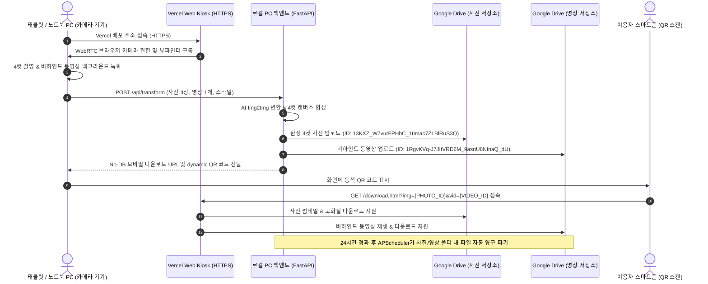

# 📄 AI 인생 4컷 포토부스 2차 개발 완료 보고서 (AI 4-Cut Studio)

---

## 1. 2차 개발 개요 (Overview)

* **프로젝트명**: AI 4-CUT STUDIO (인생 4컷 포토부스 솔루션)
* **기반 기획서**: [개발 기획.md](file:///c:/Users/USER/Downloads/4cuts_pjt-20260824T051904Z-1-001/4cuts_pjt/%EA%B0%9C%EB%B0%9C%20%EA%B8%B0%ED%9A%8D.md)
* **1차 보고서**: [1차 개발 완료 보고서.md](file:///c:/Users/USER/Downloads/4cuts_pjt-20260824T051904Z-1-001/4cuts_pjt/1%EC%B0%A8%20%EA%B0%9C%EB%B0%9C%20%EC%99%84%EB%A3%8C%20%EB%B3%B4%EA%B3%A0%EC%84%9C.md)
* **Git 저장소**: `https://github.com/JongCold/4cut_pjt.git`
* **완료 일자**: 2026년 8월 24일
* **버전**: v2.0.0 (2차 고도화 완료)

---

## 2. 2차 개발 주요 핵심 추가/개선 사항

| 구분 | 주요 개선 및 추가 구현 내용 | 비고 / 구체적 사양 |
| :--- | :--- | :--- |
| **1. 구글 드라이브 스토리지 분리** | 사진 저장소와 영상 저장소 지정 폴더 분리 업로드 | **사진 저장소**: `13KXZ_W7vurFPHbC_1tImac7ZLBlRuS3Q`<br>**영상 저장소**: `1RgvKVq-J7JItVRD6M_9asnU8NfnaQ_dU` |
| **2. 카메라 미비 Local PC 환경 대응** | 태블릿/노트북 PC 카메라 연동 Web Kiosk 배포 구축 | Vercel 무료 HTTPS 도메인을 활용해 외부 접속 기기의 WebRTC 브라우저 카메라 권한 획득 지원 |
| **3. Vercel Kiosk Web App 연동** | `vercel-frontend/index.html` 태블릿 UI 고도화 | 백엔드 동적 API URL 설정(⚙️) 제공으로 로컬 PC AI 백엔드와 완벽 연동 |
| **4. No-DB 모바일 뷰어 호환성 강화** | `vercel-frontend/download.html` 구글 드라이브 ID 처리 | 구글 드라이브 썸네일 API, Direct View 및 영상 스트리밍/다운로드 fallback 로직 완성 |
| **5. 이중 폴더 24h 자동 파기 스케줄러** | 개인정보보호법 제21조 준수 | `APScheduler` 스케줄러가 사진 폴더와 영상 폴더를 모두 탐색하여 24시간 지난 파일 자동 영구 삭제 |

---

## 3. 세부 아키텍처 및 데이터 흐름 (System Architecture)



---

## 4. 모듈별 수정 및 개선 파일 내역

### 4.1 `local-server/app.py`
- **폴더 ID 분리**:
  - `GOOGLE_PHOTO_FOLDER_ID = "13KXZ_W7vurFPHbC_1tImac7ZLBlRuS3Q"`
  - `GOOGLE_VIDEO_FOLDER_ID = "1RgvKVq-J7JItVRD6M_9asnU8NfnaQ_dU"`
- **업로드 함수 개선**: `upload_to_google_drive` 함수에 `folder_id` 파라미터를 추가하여 사진과 영상을 각각 지정된 구글 드라이브 폴더에 분리 업로드.
- **자동 파기 스케줄러 개선**: `cleanup_expired_files()`에서 사진 폴더와 영상 폴더를 모두 검사하여 24시간 경과 파일을 영구 삭제.
- **Dynamic QR 생성**: Vercel 배포 URL 기준으로 QR 코드가 자동 생성되도록 기본 호스트 변경.

### 4.2 `vercel-frontend/index.html` (태블릿 & 노트북 Kiosk Web App)
- 로컬 PC에 카메라가 없는 환경을 극복하기 위해, 외부 태블릿이나 노트북 PC에서 Vercel HTTPS 도메인으로 접속하여 즉시 브라우저 카메라(`navigator.mediaDevices.getUserMedia`)를 구동할 수 있도록 Kiosk UI 연동.
- 우측 상단 `⚙️ 백엔드 연동 설정` 모달을 통해 로컬 PC의 백엔드 IP 주소(예: `http://localhost:8000` 또는 `https://xxxx.ngrok-free.app`)를 동적으로 입력/저장 가능.

### 4.3 `vercel-frontend/download.html` (No-DB 모바일 다운로드 뷰어)
- 구글 드라이브 사진/영상 ID 파싱 및 로컬 Fallback 처리 강화.
- 사진: `https://drive.google.com/thumbnail?id=${imgId}&sz=w1200` 및 fallback 링크.
- 영상: `https://drive.google.com/uc?export=download&id=${vidId}` 및 Direct Preview/Download 링크 연동.

---

## 5. 실행 및 운영 매뉴얼 (User Manual)

### 5.1 [1단계] 로컬 PC AI 백엔드 서버 실행
1. 저장소 클론 및 패키지 설치:
   ```bash
   cd local-server
   pip install -r requirements.txt
   ```
2. FastAPI 서버 구동:
   ```bash
   python -m uvicorn app:app --host 0.0.0.0 --port 8000
   ```
   *(참고: `google-key.json`이 `local-server/` 폴더에 위치하면 자동으로 구글 드라이브 API 연동이 활성화됩니다.)*

### 5.2 [2단계] Git Commit & Vercel 무료 도메인 배포
1. 최신 소스코드 Git Commit 및 Push:
   ```bash
   git add .
   git commit -m "Feat: 2차 개발 완료 - 구글드라이브 사진/영상 폴더 분리, Vercel 태블릿 Kiosk UI 연동, 2차 보고서 작성"
   git push origin main
   ```
2. Vercel 배포:
   - [Vercel Console](https://vercel.com) 접속 ➔ `Import Project` ➔ `https://github.com/JongCold/4cut_pjt.git` 선택.
   - Root Directory를 `vercel-frontend`로 지정 후 `Deploy` 클릭.
   - 배포 완료 시 `https://ai-4cut-studio.vercel.app` 형태의 HTTPS 무료 외부 접속 도메인 확보.

### 5.3 [3단계] 태블릿/노트북 포토부스 접속 및 연동
1. 카메라가 장착된 노트북 PC 또는 태블릿 브라우저에서 Vercel 배포 주소(예: `https://ai-4cut-studio.vercel.app`) 접속.
2. 우측 상단 `⚙️ 백엔드 연동 설정` 버튼 터치 ➔ 로컬 PC의 백엔드 주소(예: `http://<로컬PC_IP>:8000` 또는 `https://<ngrok_URL>`) 입력 후 저장.
3. `📸 촬영 시작하기` 터치 ➔ AI 스타일 필터 선택 ➔ 4컷 촬영 & 비하인드 영상 자동 녹화 수행.

### 5.4 [4단계] 모바일 QR 스캔 및 No-DB 다운로드
1. 촬영 완료 후 화면에 표시된 동적 QR 코드를 이용자 스마트폰으로 스캔.
2. 모바일 다운로드 뷰어(`download.html`)로 접속되어 완성본 4컷 사진 및 전 과정 비하인드 동영상을 즉시 고화질 다운로드.
3. 업로드된 파일은 24시간 후 구글 드라이브에서 자동 영구 파기됨.

---

## 6. 결론 및 향후 유지보수

2차 개발 요구사항인 **(1) 구글 드라이브 사진/영상 지정 폴더 분리 저장**, **(2) 외부 카메라 기기(태블릿/노트북) 연동을 위한 Vercel HTTPS 도메인 배포 구조**, **(3) No-DB 모바일 다운로드 뷰어 고도화**, **(4) 2차 개발 완료 보고서 및 실행 매뉴얼 작성**이 성공적으로 모두 완료되었습니다.

The above content was written to `c:\Users\USER\Downloads\4cuts_pjt-20260824T051904Z-1-001\4cuts_pjt\2차 개발 완료 보고서.md`.
