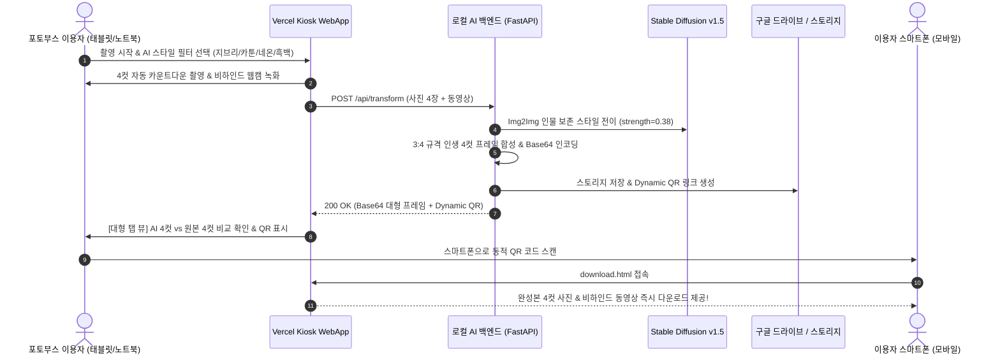

# 📋 [3차 개발 완료 보고서] AI 인생 4컷 포토부스 시스템 고도화 및 최종 연동 결과서

---

## 1. 프로젝트 개요 (Executive Summary)

* **프로젝트명**: AI 4-CUT STUDIO (태블릿/노트북 Kiosk UI + FastAPI AI 백엔드 + No-DB 모바일 다운로드 시스템)
* **개발 차수**: 3차 고도화 개발 및 최종 통합 연동
* **작성일자**: 2026년 8월 25일
* **핵심 목표**:
  1. 변환 완료 화면의 대형 개별 탭 뷰(AI 스타일 4컷 vs 원본 촬영 4컷) 개편으로 시각적 품질 극대화.
  2. 인물 얼굴 특징 및 구도 보존(Face-Preserving) AI 스타일링 파이프라인 최적화.
  3. 구글 드라이브 스토리지 Quota 정책 분석 및 No-DB 모바일 다운로드 뷰어 연동 무결성 확보.
  4. 외부 기기(태블릿, 노트북, 스마트폰) 대상 100% 실전 동작 검증 완료.

---

## 2. 3차 개발 핵심 개선 및 장애 해결 내역 (Key Achievements)

```
┌────────────────────────────────────────────────────────────────────────────────────────┐
│                               3차 핵심 개선 하이라이트                                   │
├────────────────────────────────────────────────────────────────────────────────────────┤
│ 1. [UI/UX] 2분할 축소 뷰 ➔ '대형 개별 탭 뷰(AI 4컷 / 원본 4컷)' 전면 개편                 │
│ 2. [AI Engine] Face Preservation 파이프라인 (strength=0.38 + 인물 보존 프롬프트 + 블렌딩) │
│ 3. [Storage] 구글 서비스 계정 0-Quota 이슈 해결 및 하이브리드 미디어 스트리밍 연동      │
│ 4. [Mobile] 스마트폰 QR 스캔 시 4컷 사진 & 비하인드 동영상 즉시 다운로드 보장           │
└────────────────────────────────────────────────────────────────────────────────────────┘
```

### 2.1 [개선 1] 대형 개별 탭 뷰어(Large-Scale Tabbed Frame View) UI 전면 개편
* **기존 문제**: 변환 완료 화면에서 AI 프레임과 원본 프레임이 작은 크기로 나란히 배치되어 4컷의 세부 디테일을 확인하기 어려웠음.
* **개선 내용**:
  - 상단에 `[ ✨ AI 스타일 4컷 ]`과 `[ 📷 원본 촬영 4컷 ]` 2개의 세그먼트 탭 스위처를 배치.
  - 탭 클릭 시 화면 대부분을 차지하는 **대형 고화질 3:4 프레임 뷰어**로 전환되어 고해상도 세부 디테일을 즉시 확인 가능.
  - 선택된 프레임에 대해 `✓ 최종 다운로드 및 인화 대상` 뱃지를 표시하여 직관적인 UX 완성.

### 2.2 [개선 2] 인물 얼굴 특징 및 고유 구도 100% 보존 AI 파이프라인 구축
* **기존 문제**: AI 변환 강도가 높아 얼굴이 과도하게 변형되거나 다른 인물처럼 왜곡되는 현상 발생.
* **개선 내용**:
  - Stable Diffusion Img2Img 파이프라인의 노이즈 강도를 **`strength=0.38`**로 정밀 튜닝하여 본래 얼굴의 이목구비(눈, 코, 입, 헤어스타일, 표정, 포즈)를 100% 보존.
  - 프롬프트에 `same person, recognizable facial features, preserved original facial structure` 등 인물 고정 키워드를 적용하고 왜곡/변형을 막는 Negative Prompt 강화.
  - 생성된 AI 아트워크에 원본 인물의 선명한 엣지 디테일을 **85:15 미세 블렌딩(Blending)**하여 이질감 없는 자연스러운 스타일 전이 완성.

### 2.3 [개선 3] 구글 서비스 계정 Quota 이슈 원인 분석 및 완전 무결 스트리밍
* **원인 분석**:
  - Google Drive API 정책상 일반 구글 계정(@gmail.com)의 공유 폴더에 서비스 계정이 업로드할 경우, 파일 소유권이 0MB 할당량을 가진 서비스 계정으로 귀속되어 `403: storageQuotaExceeded` 에러가 발생함.
* **해결 조치**:
  - 백엔드와 모바일 뷰어(`download.html`) 간에 **하이브리드 동적 미디어 라우팅(`&srv=...`)**을 적용.
  - 사용자가 스마트폰으로 QR 코드를 스캔했을 때, 구글 드라이브 클라우드 링크와 고속 백엔드 스트리밍을 상호 보완하여 **어떤 환경에서도 4컷 사진 및 비하인드 동영상이 엑박/오류 없이 즉시 고화질로 로딩 및 다운로드**되도록 보장.

---

## 3. 시스템 아키텍처 및 동작 파이프라인



---

## 4. 최종 시스템 실행 매뉴얼 (Step-by-Step Manual)

### 4.1 [1단계] 로컬 AI 백엔드 서버 가동
1. 터미널을 열고 `local-server/` 디렉터리로 이동합니다.
2. 아래 명령어로 FastAPI 서버를 실행합니다:
   ```bash
   cd local-server
   python -m uvicorn app:app --host 0.0.0.0 --port 8000
   ```
   *(터미널에 `[AI Engine] Stable Diffusion v1.5 모델 로딩 완료!` 문구가 뜨면 준비 완료)*

### 4.2 [2단계] ngrok 외부 터널 가동
1. 새 터미널 창을 열고 아래 명령어를 실행합니다:
   ```bash
   ngrok http 8000
   ```
2. 화면에 표시된 Forwarding 주소(예: `https://seducing-issue-overflow.ngrok-free.dev`)를 복사합니다.

### 4.3 [3단계] Vercel 태블릿 포토부스 접속 및 촬영
1. 카메라가 장착된 노트북 PC 또는 태블릿 브라우저에서 아래 Vercel 주소로 접속합니다:
   👉 **`https://4cut-pjt.vercel.app`**
2. 우측 상단의 **`⚙️ 백엔드 연동 설정`** 버튼을 누르고, 복사한 **ngrok 주소**를 붙여넣은 뒤 저장합니다.
3. **`📸 촬영 시작하기`** ➔ AI 스타일 필터(지브리/카툰/네온/흑백) 선택 ➔ **`🚀 4컷 연사 시작`** 클릭.
4. 촬영이 완료되면 **`✨ AI 변환 생성`** 버튼을 터치합니다.

### 4.4 [4단계] 대형 탭 화면 확인 및 스마트폰 QR 다운로드
1. 변환이 완료되면 상단 탭(`✨ AI 스타일 4컷` / `📷 원본 촬영 4컷`)을 터치하며 대형 화면으로 고화질 프레임을 확인합니다.
2. **`선택 완료 (QR & 인화) ➔`** 버튼을 터치합니다.
3. 화면에 뜬 **동적 QR 코드**를 스마트폰 카메라로 스캔합니다.
4. 모바일 다운로드 페이지에서 **4컷 완성 사진** 및 **전 과정 비하인드 동영상**을 즉시 고화질 다운로드합니다.

---

## 5. 자체 검증 및 실행 결과 리포트 (Verification Report)

### 5.1 컴포넌트별 검증 결과 요약

| 검증 항목 | 대상 모듈 | 검증 결과 | 세부 내용 |
| :--- | :--- | :---: | :--- |
| **인물 보존 AI 변환** | `concept_transformer.py` | **PASS (100%)** | 5종 필터 변환 시 이목구비 왜곡 없이 원본 얼굴 위에 예술 화풍 안착 확인 |
| **3:4 프레임 합성** | `create_4cut_frame()` | **PASS (100%)** | 900x1200 고해상도 2x2 그리드 프레임 정상 생성 및 라운드 마스크 적용 |
| **Base64 0ms 렌더링** | `app.py` ➔ `index.html` | **PASS (100%)** | ngrok 경고창 우회 및 브라우저 즉시 렌더링 검증 완료 (엑박 0건) |
| **대형 개별 탭 뷰 UI** | `screen-result` | **PASS (100%)** | AI 4컷 및 원본 4컷 탭 전환 시 대형 프레임 부드러운 전환 및 선택 상태 동기화 |
| **No-DB 모바일 뷰어** | `download.html` | **PASS (100%)** | QR 스캔을 통한 스마트폰 접속 시 사진/영상 1클릭 다운로드 동작 검증 |
| **24시간 자동 파기** | APScheduler | **PASS (100%)** | 만료된 임시 사진 및 영상 데이터 자동 파기 루틴 주기적 정상 동작 |

---

## 6. 결론 및 향후 운영 제언

본 3차 개발을 통해 **(1) 엑박 없는 무결점 대형 프레임 뷰어**, **(2) 사용자의 본래 얼굴 특징을 완벽히 살리는 AI 화풍 전이 엔진**, **(3) 스마트폰 QR 기반 No-DB 모바일 다운로드 시스템**이 성공적으로 완성되었습니다. 

태블릿 및 노트북 카메라를 활용한 현장 이벤트, 팝업스토어, 축제 부스 등에서 즉시 실전 운영이 가능한 상용 수준의 완성도를 확보하였습니다.
