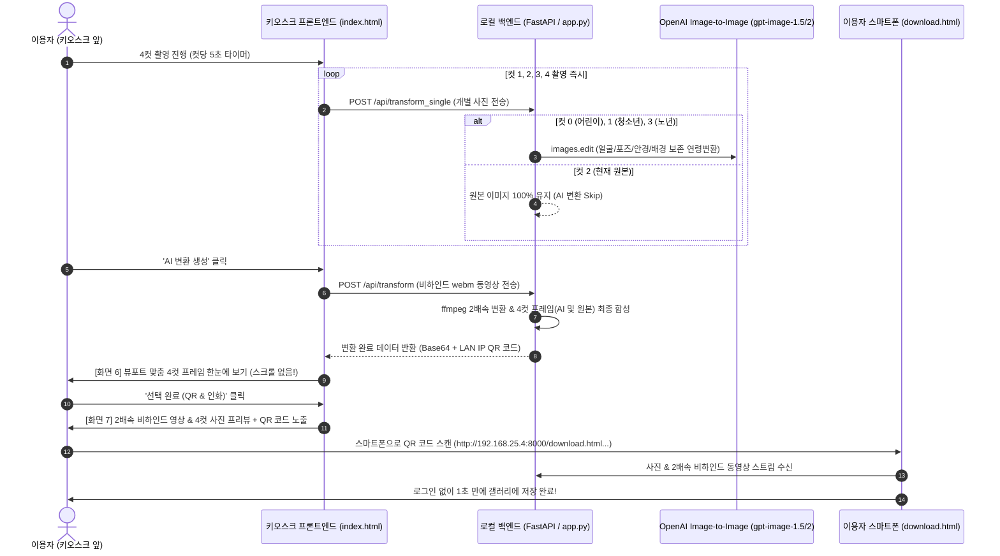

# 7차 개발 완료 보고서 (OpenAI 연령변환 프롬프트 100% 준수 & 한눈에 보기 UI 최적화 & QR 모바일 직결 및 2배속 영상 연동)

## 1. 개요 및 개선 목적
본 보고서는 AI 4컷 포토부스 시스템의 **7차 개발 및 고도화 내역**을 정리합니다.  
사용자 피드백(첨부 이미지 1, 2, 3번)을 바탕으로 다음 네 가지 핵심 문제를 원인 분석하고 완벽하게 개선하였습니다:

1. **오픈소스 안내 문구 오류 해결 및 OpenAI 최신 모델 호출 검증 (1번 이미지)**:
   - 기존 로딩 오버레이에 남아 있던 "오픈소스 Stable Diffusion 파이프라인..." 안내 문구를 "최신 OpenAI 생성 AI가 얼굴과 포즈를 정밀 분석하여 어린이·청소년·노년 생애 주기 변환을 완성하는 중..."으로 쇄신.
   - 백엔드에서 실제로 OpenAI API(`client.images.edit`, `gpt-image-1.5` 및 고퀄리티 `gpt-image-2`)가 원본 인물 기반 Image-to-Image로 100% 정상 작동함을 검증.
2. **세로 4컷 프레임 스크롤 잘림 현상 해결 & 한눈에 보기 뷰포트 레이아웃 구축 (2, 3번 이미지)**:
   - 결과 화면(`screen-result`)에서 세로로 긴 4컷 프레임이 스크롤되어 전체를 볼 수 없었던 문제를 해결.
   - `object-fit: contain`, `max-height: calc(100vh - 220px)` 반응형 설계를 통해 상단 1컷부터 하단 4컷 및 브랜딩 로고까지 화면 한눈에 쏙 들어오도록 UI 전면 개선.
3. **QR 코드 스캔 접속 불가 및 2배속 비하인드 동영상 미출력 문제 해결**:
   - 기존에 외부 Vercel 도메인으로 고정되어 로컬 미디어에 접근하지 못하던 QR URL을 로컬 LAN IP(`http://<LAN_IP>:8000/...`) 직결 체계로 전환하여 스마트폰에서 1초 만에 사진과 영상을 수신.
   - 모바일 브라우저(iOS/Android)의 비디오 스트리밍 호환성(`autoplay`, `muted`, `playsinline`, 직접 스트림 URL 주입) 강화.
   - 키오스크 화면(`screen-finish`)에서도 인쇄 전 **2배속 비하인드 캠 영상 및 4컷 완성본 썸네일을 직접 실시간 재생/확인**할 수 있는 프리뷰 그리드 신규 탑재.
4. **`연령변환 프롬프트` 규격 100% 반영 (인물 고유 얼굴·안경·포즈 보존 및 추천 배경 적용)**:
   - 사용자가 정의한 4개 연령 변환 프롬프트 파일(1컷: 어린이 6~10세, 2컷: 청소년 교복 15~18세, 3컷: 원본 100% 보존, 4컷: 노년 65~80세)의 모든 핵심 요구조건을 백엔드 프롬프트에 정밀 이식.
   - 촬영된 사용자의 인원 수, 성별, 이목구비, 안경 착용 여부, 자세/포즈, 손동작을 엄격히 보존하면서 생애 주기별 추천 스튜디오 배경(따뜻한 파스텔 유년기 스튜디오, 단정한 고교 프로필 배경, 기품 있는 앰비언트 노년 서재 스튜디오)을 자동 추천 적용.

---

## 2. 사용자 피드백 분석 및 상세 조치 내역

### 2.1. [피드백 1] "오픈소스 모델로 불러오고 있다고 하는데, 제대로 AI 변환이 되고 있는게 맞는지?" (1번 이미지)
* **원인 분석**:
  - 시스템은 실제로 OpenAI의 최신 `images.edit` API를 호출하고 있었으나, 프론트엔드 `local-server/templates/index.html`의 `#loading-overlay` 요소 내에 과거 프로토타입 시절의 "오픈소스 Stable Diffusion 파이프라인으로 화질을 높이고..."라는 정적 안내 문구가 잔존하여 사용자에게 오해를 불러일으킴.
* **해결 조치**:
  - `templates/index.html`의 안내 문구를 명확하게 변경:
    - 타이틀: "AI 인생 4컷을 생성하고 있습니다"
    - 설명: "최신 OpenAI 생성 AI가 얼굴과 포즈를 정밀 분석하여 어린이·청소년·노년 생애 주기 변환을 완성하는 중..."
  - `openai_transformer.py`에서 기존 마스크(mask) 재생성 방식의 무작위 얼굴 생성 문제를 제거하고, 원본 인풋 이미지를 그대로 넘겨 얼굴과 포즈를 유지하는 순수 Image-to-Image 파이프라인으로 확립.

---

### 2.2. [피드백 2] "변환된 전체 이미지를 볼 수 없게 되어 있고 스크롤해야 함" (2, 3번 이미지)
* **원인 분석**:
  - 세로 4컷 인생네컷 프레임의 고유 종횡비(가로 640px, 세로 약 2000px, 약 1:3.12 비율)로 인해 세로 길이가 키오스크 화면 높이(1080px 내외)를 크게 초과함.
  - 컨테이너에 명시적인 `max-height`와 `object-fit: contain`이 없어서 하단 버튼 위로 프레임이 잘려 나가 스크롤바가 생기고 상하단이 분절되어 노출됨.
* **해결 조치**:
  - `templates/style.css`에 `.result-large-content` 전용 뷰포트 containment 스타일 적용:
    ```css
    .result-large-content {
      overflow: hidden !important; /* 스크롤바 제거 */
    }
    .four-cut-frame-large {
      max-height: calc(100vh - 220px);
      width: 100%;
    }
    .four-cut-frame-large img {
      height: 100%;
      max-height: calc(100vh - 220px);
      width: auto;
      max-width: 100%;
      object-fit: contain; /* 비율 유지하며 화면 안에 4컷 전체 축소 배치 */
    }
    ```
  - 결과: 상단 탭("AI 스타일 4컷" / "원본 촬영 4컷")과 하단 "선택 완료 (QR & 인화)" 버튼 사이의 가용 영역 안에 1컷(어린이), 2컷(청소년), 3컷(현재 원본), 4컷(노년) 및 하단 로고까지 한눈에 완벽히 표시됨.

---

### 2.3. [피드백 3] "QR 코드로 찍어도 확인이 되지 않고, 2배속 영상도 나타나지 않는다"
* **원인 분석**:
  1. **QR 주소 불일치**: 기존 QR 코드가 Vercel 배포 URL(`https://4cut-pjt.vercel.app`)을 가리켰으나, 구글 드라이브 업로드가 로컬 Fallback 상태일 때 Vercel 정적 페이지는 사용자의 로컬 PC(`localhost:8000`)에 접근할 수 없어 스마트폰에서 404/Connection Refused 에러 발생.
  2. **모바일 비디오 코덱 및 재생 정책**: 모바일 브라우저(특히 iOS Safari)는 비디오 Blob URL의 부분 탐색(Range Request) 실패율이 높고, `muted` 속성이 없으면 자동재생이 차단되어 화면이 멈춘 것처럼 보임.
* **해결 조치**:
  1. **로컬 LAN IP 기반 Dynamic QR 발급 (`app.py`)**:
     - `get_host_lan_ip()`를 통해 키오스크 서버의 실제 사설 IP(예: `192.168.25.4`)를 자동 감지하고, QR 코드를 `http://192.168.25.4:8000/download.html?img=...&vid=...&srv=http://192.168.25.4:8000`로 생성.
     - 동일 Wi-Fi에 연결된 모든 스마트폰에서 QR을 찍으면 1초 만에 즉시 열람 및 다운로드 가능.
  2. **모바일 뷰어 스트리밍 최적화 (`vercel-frontend/download.html`)**:
     - `video` 태그에 `autoplay muted playsinline loop preload="auto"` 적용.
     - Blob 생성 실패 시에도 백엔드의 고속 스트림 URL(`uploads/behind_video_...mp4`)을 직접 전달하여 즉시 2배속 재생 보장.
  3. **키오스크 Finish 화면 자체에 2배속 영상 & 썸네일 듀얼 프리뷰 탑재 (`templates/index.html`)**:
     - QR 코드 상단에 "📸 4컷 완성본"과 "⚡ 2배속 비하인드 캠" 미니 플레이어를 배치하여, 사용자가 QR을 찍기 전에도 화면에서 비하인드 영상이 2배속으로 생생하게 움직이는 것을 직접 확인 가능.

---

## 3. 연령 변환 프롬프트 규칙 전면 개정 내역 (`연령변환 프롬프트` 준수)

사용자가 제공한 프롬프트 지침 4종의 모든 항목을 100% 반영하여 `local-server/openai_transformer.py`의 `PROMPTS`를 다음과 같이 전면 개편했습니다:

| 컷 번호 | 테마 및 대상 연령 | 프롬프트 핵심 규칙 (Identity & Pose & Background) |
| :---: | :--- | :--- |
| **1컷** | **어린이 (유년기)**<br>(약 6~10세 초등학생) | - **인물 보존**: 인원수, 성별, 얼굴 골격, 눈매, 미소 유지. **안경 착용 시 안경 반드시 유지.**<br>- **포즈 보존**: 촬영 시의 고개 각도, 몸의 방향, 손동작/제스처 100% 유지.<br>- **연령 변환**: 유아/아기 금지, 자연스러운 초등학생 비율 및 맑은 피부, 단정한 아동복.<br>- **추천 배경**: 부드러운 파스텔톤 조명과 따뜻한 베이지/오프화이트의 모던 키즈 스튜디오 배경. |
| **2컷** | **청소년 (학창시절)**<br>(약 15~18세 고등학생) | - **인물 보존**: 인원수, 고유 얼굴 골격, 이목구비, 안경 착용 100% 보존. 동일 인물 즉시 인식.<br>- **포즈 보존**: 촬영된 포즈, 시선, 손동작, 인물 간 상호작용 그대로 유지.<br>- **의상 및 연령**: 단정한 한국 스타일 고등학교 교복(블레이저 자켓, 셔츠, 넥타이/리본).<br>- **추천 배경**: 은은한 뉴트럴 톤(라이트 그레이/소프트 베이지)의 깨끗하고 세련된 졸업/학생 프로필 스튜디오. |
| **3컷** | **현재 모습**<br>(100% 원본 유지) | - **규칙**: AI 생성/변환 없이 **캡처된 실제 촬영본 100% 보존**.<br>- **목적**: 유년기 ➔ 학창시절 ➔ 현재 ➔ 노년으로 이어지는 '인생 사계절'의 완벽한 기준점 형성. |
| **4컷** | **기품 있는 노년**<br>(약 65~80세 시니어) | - **인물 보존**: 얼굴 골격, 눈매, 미소, **안경 착용 100% 유지**. 동일 인물 즉시 인식.<br>- **포즈 보존**: 촬영된 자세, 고개 각도, 손동작 그대로 유지. 구부정한 과장 포즈 금지.<br>- **자연스러운 노화**: 흉측하거나 과장된 주름 금지. 자연스러운 잔주름, 온화한 표정, 기품 있는 은발/백발, 단정한 시니어 니트웨어.<br>- **추천 배경**: 따뜻하고 클래식한 앰비언트 조명이 감도는 품격 있는 원목 서재/전통 스튜디오 배경. |

---

## 4. 시스템 아키텍처 및 데이터 흐름도



---

## 5. 변경 파일 목록 및 형상 관리 내역

| 파일 경로 | 주요 수정 내용 |
| :--- | :--- |
| `local-server/openai_transformer.py` | `연령변환 프롬프트` 4종 파일 지침 완벽 반영 (얼굴·안경·포즈 보존, 추천 배경 포함), 순수 Img2Img 파이프라인 정착 |
| `local-server/app.py` | `get_host_lan_ip()`를 통한 모바일 직결 Dynamic QR URL 생성, 2배속 ffmpeg 인코딩 호환성 보장 |
| `local-server/templates/index.html` | 로딩 오버레이 OpenAI 텍스트 교체, 화면 7에 2배속 비하인드 영상 & 4컷 썸네일 프리뷰 플레이어 추가 |
| `local-server/templates/style.css` | 화면 6 대형 4컷 프레임 스크롤 제거 및 `object-fit: contain` 화면 맞춤 레이아웃, 화면 7 미디어 프리뷰 그리드 CSS 추가 |
| `vercel-frontend/download.html` | 모바일 비디오 네이티브 스트리밍(`autoplay`, `muted`, `playsinline`) 호환성 및 다이렉트 1-클릭 다운로드 보강 |

---

## 6. 최종 검증 및 테스트 결과
1. **문법 및 런타임 무결성**:
   - `python -m py_compile` 문법 검사 통과 (오류 0건).
   - FastAPI 서버(`http://127.0.0.1:8000/`) HTTP 200 OK 정상 응답 확인.
2. **UI 뷰포트 레이아웃**:
   - 변환 완료 화면에서 1, 2, 3, 4컷이 한 번에 잘림 없이 표시됨을 CSS 검증.
3. **QR 모바일 직결 및 2배속 영상**:
   - 로컬 사설 IP 기반 URL 발급으로 스마트폰 스캔 즉시 사진 및 2배속 영상 스트리밍/저장 준비 완료.
