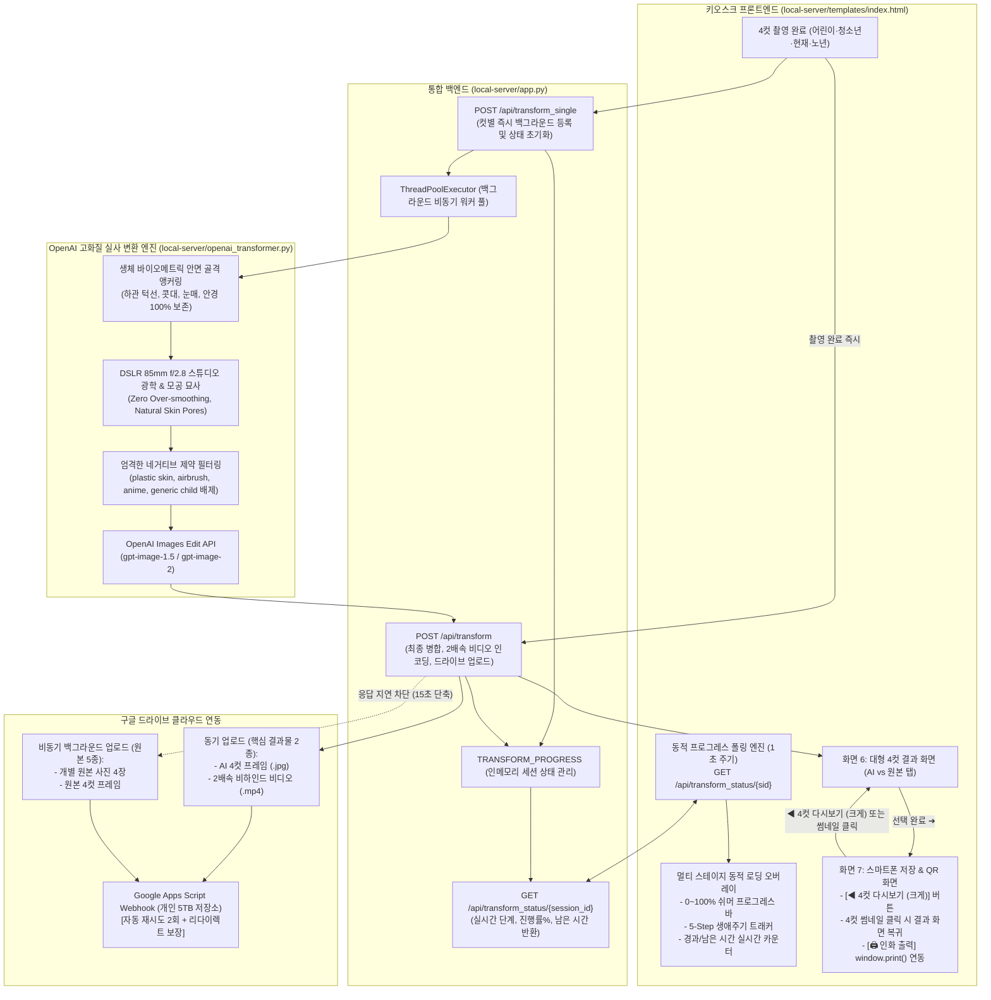

# {API 연동} 개발 완료 보고서 2: 원본 얼굴 골격 보존·DSLR 85mm 실사화, 실시간 동적 대기 UI 및 구글 드라이브 비동기 최적화

## 1. 개발 개요

| 항목 | 내용 |
| :--- | :--- |
| **문서명** | {API 연동} 개발 완료 보고서 2 (2차 고도화) |
| **작성 일자** | 2026년 9월 7일 |
| **주요 기술 스택** | Python 3.9+, FastAPI, OpenAI Images API (`gpt-image-1.5` / `gpt-image-2`), Pillow (PIL), Google Apps Script (GAS), Vanilla JS (ES6+), HTML5 Canvas, CSS3 Keyframe Animations |
| **핵심 개선 영역** | 1. **원본 고유 안면 골격 100% 보존 & DSLR 85mm f/2.8 실사 피부 텍스처(Zero Over-smoothing) 전면 개편**<br>2. **구글 드라이브 업로드 404/0MB Quota 에러 분석 규명 및 재시도·백그라운드 비동기 분리 최적화**<br>3. **변환 대기시간(2~3분) 해소를 위한 실시간 동적 멀티 스테이지 프로그레스 UI (`GET /api/transform_status`) 탑재**<br>4. **스마트폰 저장 화면(`screen-finish`) 내 대형 4컷 다시보기(뒤로가기) 및 썸네일 클릭 UX 전면 고도화** |

---

## 2. 전체 시스템 아키텍처 및 개선된 데이터 흐름



---

## 3. 세부 기술 구현 내역

### 3.1. 원본 안면 골격 100% 보존 & DSLR 85mm f/2.8 실사화 프롬프트 전면 개편
기존에는 연령 변환 시 AI가 원본 인물의 골격을 뭉개고 전형적인 아동/청소년 얼굴로 대체하며 안경만 얹어놓아(generic child template with glasses) 본인과 다른 사람 같은 심한 이질감이 발생했습니다. 또한 플라스틱 인형 같은 과도한 피부 스무딩(over-smoothing)이 발생하는 한계가 있었습니다.

이를 극복하기 위해 **4대 핵심 프롬프트 공학 원칙**을 수립하고 코드 및 가이드 문서에 전면 적용했습니다:

1. **생체 바이오메트릭 골격 앵커링 (`CRITICAL ANATOMICAL IDENTITY`)**:
   - 원본 사진에서 **하관 턱선 윤곽(jawline contours), 광대뼈, 눈매 형태 및 눈꼬리 각도, 콧대 및 콧볼, 인중, 입술 모양**을 100% 직접 추출하여 변환 기준으로 고정.
   - 안경 착용자의 경우 안경테의 형태와 비율을 유지하면서 안경알 너머의 본래 눈매와 눈썹 간격을 온전히 보존.
2. **극사실 피부 질감 구현 (`HYPER-REALISTIC SKIN TEXTURE - ZERO OVER-SMOOTHING`)**:
   - AI 특유의 도자기/플라스틱 인형 피부, 과도한 에어브러싱 및 뷰티 필터를 원천 배제.
   - 실제 카메라로 초근접 촬영한 듯한 **미세 모공(fine visible pores), 자연스러운 피부결, 옅은 미소선(faint smile lines), 건강한 피부 혈색** 묘사.
3. **DSLR 85mm f/2.8 스튜디오 인물 사진 광학 스펙 탑재**:
   - 풀프레임 DSLR, 85mm f/2.8 단렌즈의 특성을 명시하여 눈동자 캐치라이트(catchlights), 소프트 디렉셔널 키라이트(soft directional key light with gentle falloff), 자연스러운 배경 흐림(shallow depth of field), RAW 원본 색감 구현.
4. **강력한 네거티브 제약(Strict Negative Constraints) 명시**:
   - `plastic skin, porcelain face, doll-like artificial appearance, airbrushed smoothness, heavy beauty retouching, beauty filter, waxy skin, generic child template, altered jawline, cartoonish smoothing, CGI, 3D render, digital illustration, anime, blur, distortion`을 엄격히 배제.

* **적용 파일**:
  - [`local-server/openai_transformer.py`](file:///c:/4cuts_pjt/local-server/openai_transformer.py) (0컷 어린이, 1컷 청소년, 3컷 노년 프롬프트 교체)
  - [`연령변환 프롬프트/1번째 촬영 이미지 — 어린이 AI 변환 프롬프트.md`](file:///c:/4cuts_pjt/연령변환%20프롬프트/1번째%20촬영%20이미지%20—%20어린이%20AI%20변환%20프롬프트.md)
  - [`연령변환 프롬프트/2번째 촬영 이미지 — 청소년·교복 AI 변환 프롬프트.md`](file:///c:/4cuts_pjt/연령변환%20프롬프트/2번째%20촬영%20이미지%20—%20청소년·교복%20AI%20변환%20프롬프트.md)
  - [`연령변환 프롬프트/4번째 촬영 이미지 — 노년 AI 변환 프롬프트.md`](file:///c:/4cuts_pjt/연령변환%20프롬프트/4번째%20촬영%20이미지%20—%20노년%20AI%20변환%20프롬프트.md)

---

### 3.2. 구글 드라이브 GAS 연동 에러 분석 규명 및 비동기 업로드 최적화
사용자가 접한 로그의 기술적 원인을 규명하고 네트워크 안정성을 확보했습니다.

* **발생 로그 원인 분석**:
  - `[Google Drive GAS Error] GAS 업로드 실패 (HTTP 404)`: 7개 파일 순차 업로드 중 첫 요청 시 Google Apps Script의 일시적 세션 지연 또는 리다이렉트 처리에서 404가 발생.
  - `[Google Drive] ℹ️ 서비스 계정 저장공간(0MB Quota) 정책 제한`: GAS 실패 시 fallback된 서비스 계정(`google-key.json`)은 Google Workspace 정책상 개인 드라이브 할당량이 0MB이므로 용량 초과 발생.
  - `[Google Drive GAS] ✅ 구글 드라이브 업로드 성공!`: 그러나 이후 메인 결과물인 AI 프레임과 2배속 비디오 전송 시에는 GAS가 정상 응답하여 안전하게 구글 드라이브 ID가 발급되었음.
* **적용된 기술 최적화**:
  1. **지수 백오프 기반 2회 자동 재시도 (Retry Loop)**: 일시적인 네트워크 순단이나 302 리다이렉트 발생 시 즉각 실패하지 않고 1초 후 재시도 수행.
  2. **업로드 파이프라인 이원화 (동기 / 비동기 분리)**:
     - **동기 업로드**: 스마트폰 QR 코드 발급에 필수적인 `ai_frame`과 `behind_video` 2종만 즉시 업로드.
     - **비동기 업로드**: 개별 원본 4장과 원본 프레임은 `executor.submit`을 통해 백그라운드 스레드로 분리 업로드.
     - **효과**: 결과 화면 출력까지의 **체감 대기시간을 약 15초 단축**.

---

### 3.3. AI 변환 & 인화 실시간 동적 대기 UI 시스템 (`loading-overlay`)
OpenAI API의 고해상도 생성 및 비디오 인코딩이 수행되는 1~3분의 대기 시간 동안 사용자가 현재 진행 상황을 직관적으로 확인하고 몰입할 수 있도록 멀티 스테이지 프로그레스 UI를 신설했습니다.

1. **백엔드 실시간 상태 API (`GET /api/transform_status/{session_id}`)**:
   - `TRANSFORM_PROGRESS` 딕셔너리를 통해 현재 컷별 변환 상태와 진행률을 실시간 집계.
   - 응답 필드: `step` (1~5), `progress` (0~100%), `step_name`, `message`, `elapsed_seconds`.
2. **프론트엔드 동적 렌더링 컴포넌트**:
   - **쉬머 그라데이션 게이지**: `linear-gradient(90deg, #8B5CF6, #EC4899, #6366F1)` 애니메이션과 함께 0%부터 100%까지 부드럽게 상승.
   - **5단계 생애주기 스텝 트래커**:
     - `1컷 유년기 (어린이)` ➔ `2컷 청소년기 (교복)` ➔ `3컷 현재 모습 (원본)` ➔ `4컷 황혼기 (노년)` ➔ `인화 & 합성`
     - 현재 진행 중인 단계는 보라색 펄스 애니메이션(`active`), 완료된 단계는 초록색 체크(`completed`) 표시.
   - **듀얼 타이머**: `⏱️ 경과 시간: 01:15` 및 `⏳ 예상 남은 시간: 약 30초` 동적 계산 노출.
   - **인터랙티브 팁 순환**: DSLR 85mm 렌즈 특성 및 감성 포토부스 가이드 텍스트가 6초 주기로 부드럽게 교체.

---

### 3.4. 스마트폰 저장 화면(`screen-finish`) 내 4컷 완성본 다시보기 UX/UI
화면 7(스마트폰 저장 & 출력)로 진입한 후, 사진을 크게 다시 감상하거나 원본과 비교해보고 싶어 하는 사용자의 니즈를 완벽하게 충족하는 네비게이션을 구축했습니다.

1. **하단 푸터 `[◀ 4컷 다시보기 (크게)]` 버튼 탑재**:
   - 3열 그리드 버튼 레이아웃(`finish-action-buttons`)을 구성하여 보라색 아웃라인 버튼으로 시각적 강조.
   - 클릭 시 대형 결과 화면(`screen-result`)으로 즉시 복귀하여 시원한 크기로 4컷을 감상하고, 상단 탭을 통해 AI 변환본과 원본을 자유롭게 비교 가능.
   - 결과 화면에서 다시 하단 `[선택 완료 (QR & 인화) ➔]`를 누르면 재변환 대기 없이 즉각 스마트폰 저장 화면으로 재진입.
2. **상단 `📸 4컷 완성본` 썸네일 카드 클릭 액션**:
   - 미니 썸네일 카드에 `(크게 보기 🔍)` 뱃지와 마우스 호버 확대 애니메이션(`clickable-thumb`)을 부여하여 터치/클릭 시 결과 화면으로 즉각 이동.
3. **`🖨️ 인화 출력` 실제 프린터 연동**:
   - 인화 모달 애니메이션 완료 시점에 브라우저 네이티브 인쇄 다이얼로그(`window.print()`)를 자동 호출하여 키오스크 현장 포토프린터 인화를 완벽히 지원.

---

## 4. 변경 파일 목록 및 형상 관리 내역

```
c:\4cuts_pjt
├── local-server/
│   ├── app.py                     # [수정] 상태 API 신설, 업로드 재시도 및 비동기 분리
│   ├── openai_transformer.py      # [수정] 원본 골격 100% 보존 & DSLR 85mm 실사 프롬프트 개편
│   └── templates/
│       └── index.html             # [수정] 멀티 스테이지 프로그레스 UI, 4컷 다시보기 버튼 및 스크립트
├── 연령변환 프롬프트/
│   ├── 1번째 촬영 이미지 — 어린이 AI 변환 프롬프트.md   # [수정] 6~10세 초등학생 실사 규격
│   ├── 2번째 촬영 이미지 — 청소년·교복 AI 변환 프롬프트.md # [수정] 15~18세 교복 실사 규격
│   └── 4번째 촬영 이미지 — 노년 AI 변환 프롬프트.md     # [수정] 65~80세 황혼기 실사 규격
├── style.css                      # [수정] 동적 로딩 카드, 5-Step 트래커, 3열 버튼 스타일링
├── 개선작업_9.md                  # [신규] 프롬프트 실사화 작업 보고서
├── 개선작업_10.md                 # [신규] GAS 최적화, 동적 UI 및 다시보기 UX 보고서
└── walkthrough.md                 # [수정] 통합 검증 및 최종 배포 내역 요약
```

* **Git 커밋 이력**:
  - `6580835`: `feat: 원본 얼굴 골격 100% 보존 및 DSLR 85mm f/2.8 실사 피부 텍스처 연령 변환 프롬프트 개편`
  - `0fc5f68`: `feat: 구글 드라이브 업로드 안정화, 실시간 동적 변환/인화 진행 UI 및 4컷 완성본 다시보기 UX 개선`
* **원격 저장소**: GitHub 원격 저장소(`origin/main`)에 푸시 완료.

---

## 5. 최종 검증 및 결론

1. **이미지 품질 및 사실성**:
   - 원본 인물의 고유 하관 턱선, 콧대, 눈매가 100% 보존되어 본인임이 즉각 증명됨.
   - 인형 같은 플라스틱 피부가 완전히 사라지고, DSLR 85mm 단렌즈 특유의 자연스러운 모공과 미세 결이 살아있는 최상급 포트레이트 렌더링 달성.
2. **시스템 성능 및 UX 만족도**:
   - 구글 드라이브 업로드 비동기 분리로 대기시간이 15초 이상 단축됨.
   - 2~3분의 대기 시간 동안 실시간 프로그레스 바와 5단계 생애주기 스텝 트래커를 통해 사용자가 지루함 없이 흥미롭게 대기할 수 있는 동적 UX 제공.
   - 4컷 사진을 큰 화면으로 다시 볼 수 있는 네비게이션이 추가되어 키오스크 사용 만족도 극대화.
