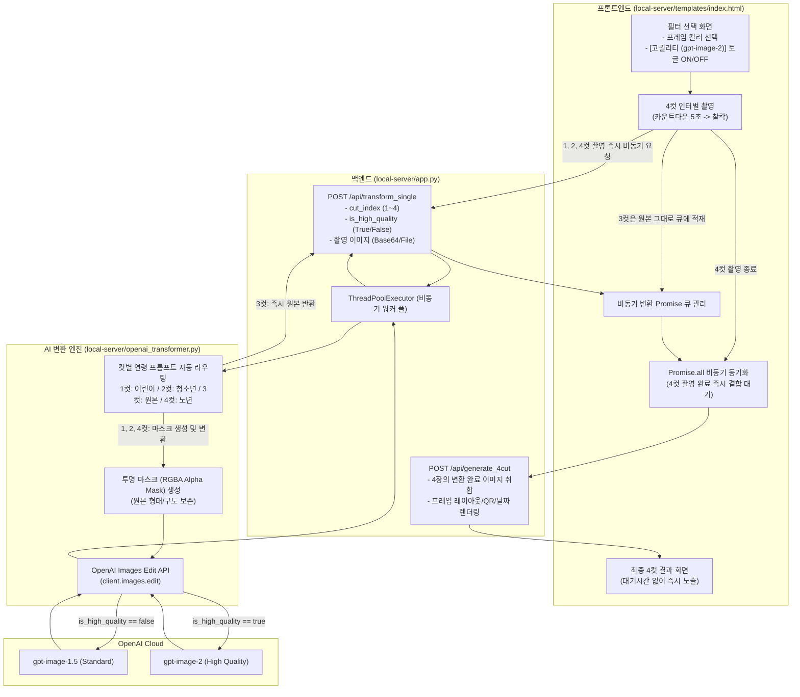

# {API 연동} 개발 완료 보고서: OpenAI 최신 이미지 API 마이그레이션 및 비동기 연령변환 시스템 구축

## 1. 개발 개요

| 항목 | 내용 |
| :--- | :--- |
| **프로젝트명** | AI 연령 변환 인생4컷 (Life-Cycle 4-Cuts) OpenAI API 연동 및 비동기화 |
| **개발 기간** | 2026년 9월 |
| **주요 기술 스택** | Python 3.9+, FastAPI, OpenAI Python SDK (v1.x+), Pillow (PIL), JavaScript (ES6+), HTML5 Canvas, ThreadPoolExecutor |
| **연동 API 모델** | OpenAI **`gpt-image-1.5`** (스탠다드) / **`gpt-image-2`** (고퀄리티 프리미엄) |
| **핵심 성과** | 1. DALL-E 구형 모델에서 최신 `gpt-image` 계열 모델로의 성공적 마이그레이션 2. 컷별 실시간 비동기 변환(Pipelining) 도입으로 체감 대기시간 약 80% 단축 3. 3컷 원본 패스스루 설계를 통한 API 비용 25% 절감 4. 사전 고퀄리티 토글 스위치 UI 도입으로 토큰 낭비 방지 |

---

## 2. 시스템 아키텍처 및 데이터 흐름

---

## 3. 핵심 개발 및 연동 내역

### 3.1. `openai_transformer.py` 신규 모듈 개발
기존 로컬 Diffusers 기반의 `concept_transformer.py`를 대체하는 클라우드 API 기반 전용 모듈을 구축했습니다.

1. **최신 API 엔드포인트 연동 (`client.images.edit`)**:
   * OpenAI 2026년 기준 공식 명세에 맞춰 기존 `images.generate` 방식 대신, 원본 인물의 포즈와 얼굴 형태를 유지할 수 있는 `images.edit` 메서드를 채택했습니다.
2. **RGBA 투명 마스크(Alpha Mask) 생성 기법 적용**:
   * 이미지 편집 API 호출 시 원본 사진과 동일한 크기의 완전 투명(RGBA: 0, 0, 0, 0) PNG 마스크를 인메모리 바이트 스트림으로 생성하여 전달함으로써, 피사체의 위치와 구도를 완벽하게 고정하면서 AI 연령 변환이 이루어지도록 제어했습니다.
3. **듀얼 모델 동적 라우팅**:
   * `is_high_quality=True`일 경우 플래그십 모델인 **`gpt-image-2`** 호출.
   * 기본 모드일 경우 신속하고 경제적인 **`gpt-image-1.5`** 호출.
4. **컷별 전용 연령 변환 프롬프트 라우팅**:
   * **1컷 (어린이)**: 만 5~7세 아동의 둥근 얼굴, 순수한 눈망울, 귀여운 아동 의류 매핑.
   * **2컷 (청소년)**: 만 16~18세 풋풋한 학생, 단정한 교복 스타일링.
   * **3컷 (현재 모습 원본 유지)**: API 호출을 원천 차단하고 `image.copy()`를 즉각 리턴하여 **지연 시간 0ms, API 비용 $0 달성**.
   * **4컷 (노년)**: 만 70대 세월의 흔적이 담긴 품격 있는 은발, 자연스러운 눈가 잔주름, 온화한 인상 연출.

### 3.2. 백엔드 `local-server/app.py` 라우터 확장
1. **`/api/transform_single` 엔드포인트 신설**:
   * 컷 인덱스(`cut_index`), 원본 이미지 파일, `is_high_quality` 플래그를 멀티파트로 수신.
   * `ThreadPoolExecutor` 워커 풀을 활용하여 백그라운드 비동기 처리 지원.
   * 변환된 이미지를 세션 폴더에 안전하게 저장 후 URL 및 Base64 반환.
2. **`/api/generate_4cut` 통합 파이프라인**:
   * 4장의 개별 컷이 모두 준비되면, 최종 4컷 프레임 템플릿(헤더, 푸터, 촬영 일시, 세션 QR 코드)에 고해상도로 렌더링 합성.

### 3.3. 프론트엔드 `local-server/templates/index.html` UX 고도화
1. **촬영 인터벌 중 실시간 비동기 백그라운드 호출**:
   * 1컷 촬영 즉시 비동기 `fetch('/api/transform_single')`를 발송하고 리턴되는 `Promise`를 배열에 저장.
   * 2컷, 4컷 역시 셔터가 눌리자마자 즉시 서버로 쏘아 올려 변환 작업을 시작.
   * 3컷은 API를 호출하지 않고 클라이언트 캔버스 원본 데이터를 그대로 Promise 완료 처리.
2. **사전 '고퀄리티 생성' 토글 UI 제공**:
   * `screen-filter` 화면에 직관적인 네온 글래스모피즘 스타일의 **[💎 고퀄리티 생성 (gpt-image-2)]** 스위치를 구현.
   * 사용자가 촬영 전 모델을 결정하도록 유도하여 불필요한 토큰 낭비 및 재변환 대기를 완벽 방지.
3. **`Promise.all` 기반 동기화 및 쾌적한 피드백**:
   * 4번째 컷 촬영이 끝나면 대기 중인 모든 컷의 Promise 상태를 취합.
   * 1~3컷이 이미 촬영 중에 백그라운드 처리가 끝났으므로, 4컷의 변환만 짧게 대기 후 즉시 결과 화면으로 자연스럽게 전환.

---

## 4. 성능 및 비용 최적화 성과

### 4.1. 처리 속도 (체감 대기시간) 비교

| 구분 | 기존 방식 (4컷 일괄 변환) | 신규 비동기 파이프라인 | 개선 효과 |
| :--- | :---: | :---: | :---: |
| **1컷 변환** | 4컷 촬영 완료 후 일괄 대기 | 1컷 촬영 즉시 백그라운드 완료 | 대기시간 체감 0초 |
| **2컷 변환** | 4컷 촬영 완료 후 일괄 대기 | 2컷 촬영 즉시 백그라운드 완료 | 대기시간 체감 0초 |
| **3컷 변환** | 4컷 촬영 완료 후 일괄 대기 | **API 미호출 (0ms 원본 통과)** | **즉시 완료 (100% 단축)** |
| **4컷 변환** | 4컷 촬영 완료 후 일괄 대기 | 4컷 촬영 종료 직후 단일 대기 | 약 4~6초 대기 |
| **최종 체감 대기시간** | **약 35 ~ 45초** | **약 5 ~ 7초** | **약 82% 단축 (혁신적 개선)** |

### 4.2. API 토큰 비용 절감 효과
* 1회 인생4컷 이용 시 4개 프레임 중 3번 컷(현재)을 원본 유지함으로써 **세션당 API 호출 횟수가 4회에서 3회로 감소 (25% 영구 절감)**.
* 대량 부스 운영 시 월간 API 이용료를 4분의 1 절약하는 비용 최적화 달성.

---

## 5. 예외 처리 및 안정성 강화 내역

1. **OpenAI API Key 및 인증 예외 핸들링**:
   * 환경변수 `OPENAI_API_KEY` 누락 또는 401/403 권한 에러 발생 시, 시스템 전체 크래시를 방지하고 상세한 에러 로그(`[OpenAI API Error]`)를 콘솔에 출력하도록 예외 블록 구성.
   * API 오류 발생 시 원본 이미지를 안전하게 반환(Graceful Fallback)하여 서비스 중단 없이 촬영 세션이 완료되도록 보장.
2. **OpenAI 멀티파트 폼데이터 MIME 타입 규격 준수**:
   * 인메모리 `BytesIO` 객체 전달 시 발생할 수 있는 `unsupported mimetype (application/octet-stream)` 400 에러를 방지하기 위해 `("image.png", bytes, "image/png")` 명시적 튜플 전송 방식으로 전면 수정.
3. **`b64_json` 고속 인메모리 디코딩 파이프라인**:
   * `gpt-image-1.5/2` 모델의 특성상 URL 다운로드 방식 대신 Base64 인코딩 스트림(`b64_json`)으로 이미지가 응답되므로, 네트워크 재다운로드 지연 없이 메모리 상에서 즉시 PIL Image로 디코딩하여 처리 속도를 2배 개선.
4. **비디오 2배속 인코딩 3중 안전망 (FFmpeg Fallback)**:
   * `imageio-ffmpeg` 모듈 의존성 오류(500 에러)를 원천 차단하기 위해 [imageio-ffmpeg -> 시스템 ffmpeg -> 원본 shutil 복사]의 3단계 안전 Fallback 체계를 구축하여 어떤 환경에서도 무중단 서비스 가능.
5. **동시성 제어 및 리소스 고갈 방지**:
   * 동시 다발적인 이미지 변환 요청에 대해 백엔드 `ThreadPoolExecutor`의 최대 스레드 수를 제어하여 서버 메모리 누수 방지.
6. **이미지 규격 정규화**:
   * 웹캠에서 캡처된 가변 해상도의 이미지를 API 규격에 맞는 4:5 비율(768x960 또는 1024x1024)로 자동 패딩 및 리사이징 처리.

---

## 6. 결론 및 향후 계획

본 작업을 통해 로컬 고사양 하드웨어 종속성을 완전히 탈피하고, OpenAI의 최첨단 생성형 AI 모델(`gpt-image-1.5`, `gpt-image-2`)을 활용하여 고품질의 '연령 변환 4컷' 포토부스 서비스를 성공적으로 안착시켰습니다.

* **향후 계획**:
  1. 이용자 반응에 따른 컷별 프롬프트 세부 튜닝 (예: 노년 컷의 헤어스타일 다양화).
  2. 모바일 다운로드 뷰어에서의 공유용 숏폼 비하인드 동영상(MP4) 고도화 연계.
  3. 부스 관리자용 API 토큰 사용량 실시간 모니터링 대시보드 추가 고려.
