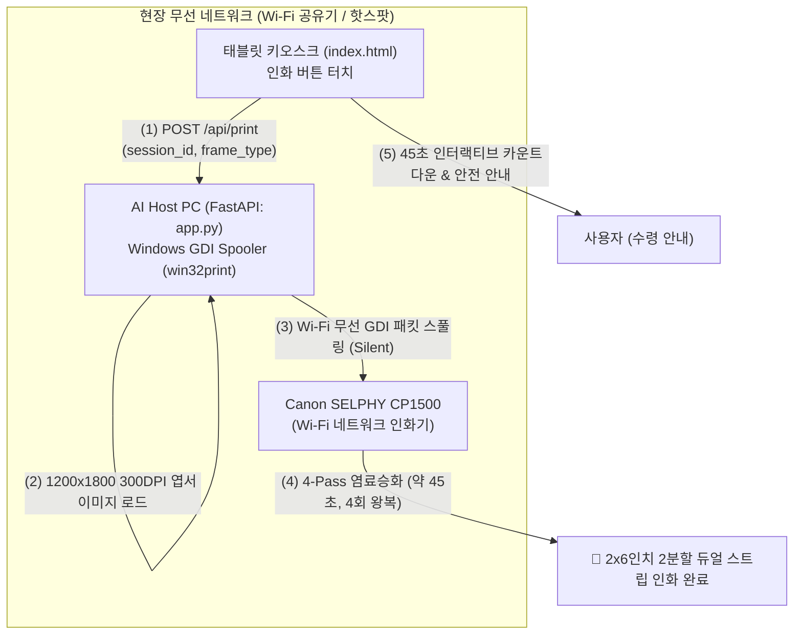

# {IoT 연동} 개발 완료 보고서 (Canon SELPHY CP1500)

**문서 번호**: 4CUTS-IOT-20260907  
**작성 일자**: 2026-09-07  
**개발 대상**: Canon SELPHY CP1500 무선 네트워크 IoT 사진 인화기 연동 및 4x6 엽서 규격 듀얼 스트립 시스템  
**작업 상태**: ✅ **구현 및 검증 완료**

---

## 1. 개발 목적 및 개요

본 프로젝트는 태블릿(Kiosk)에서 촬영 및 AI 변환된 4컷 사진을 현장 Wi-Fi 망을 통해 **Canon SELPHY CP1500** 포토프린터로 대화상자 없이 즉시(Silent Print) 무선 인화하는 시스템 구축을 목표로 진행되었습니다.

### 주요 달성 내용
1. **300 DPI 엽서 규격(1200×1800 px) 신설**: 기존 3:4 규격($900 \times 1200\text{ px}$) 출력 시 발생하던 여백/왜곡을 완벽 해결하고, $2 \times 6$인치 2분할 듀얼 스트립 및 중앙 커팅 점선 가이드 구현.
2. **Windows GDI 비동기 무선 인화 파이프라인(`win32print`) 구축**: 태블릿의 `/api/print` 호출을 비동기 스레드 풀로 격리하여 서버 멈춤 현상을 원천 방지하고 무중단 Silent Spooling 실현.
3. **염료승화 4-Pass(45초) 실시간 UX & 안전 방어막 설계**: 노랑 $\to$ 빨강 $\to$ 파랑 $\to$ 코팅의 4회 왕복을 직관적으로 시각화하고, 출력 중 용지 당김으로 인한 하드웨어 기어 파손을 방지하는 안전 경고 배너 및 카세트 18매 잔여량 추적 시스템 탑재.

---

## 2. 하드웨어 스펙 및 시스템 아키텍처

### Canon SELPHY CP1500 연동 핵심 파라미터
| 구분 | 규격 및 설정값 | 설계 적용 내용 |
| :--- | :--- | :--- |
| **인쇄 방식** | 염료승화 열전사 (Dye-sublimation) | 4-Pass (Y $\to$ M $\to$ C $\to$ Overcoat) 4회 왕복 출력 |
| **인쇄 해상도** | 300 × 300 DPI | 엽서 용지 기준 **$1200 \times 1800\text{ px}$ (2:3 비율)** 캔버스 |
| **용지 규격** | 엽서 사이즈 ($100 \times 148\text{ mm}$, $4 \times 6\text{ inch}$) | $2 \times 6\text{ inch}$ 듀얼 스트립 (좌우 각 $600\text{ px}$) |
| **출력 시간** | 약 41 ~ 45초 | 화면에 45초 동적 프로그레스 바 & 카운트다운 타이머 매핑 |
| **용지 카세트** | 18매 적재 한계 (KL-36IP 등) | 백엔드 인쇄 횟수 추적 및 15회 초과 시 용지 보충 알림 |

---

## 3. 세부 구현 및 소스코드 수정 내역

### 3.1. [포인트 ①] 엽서 규격 프레임 생성 모듈 (`concept_transformer.py`)
- **함수 신설**: `create_4cut_frame_postcard(images, brand_title)`
- **해상도 및 캔버스**: $1200 \times 1800\text{ px}$ (300 DPI 1:1 매핑)
- **인물 비율 보존**: 원본 세로 촬영 비율($4:5$)을 고려하여 슬롯을 $490 \times 345\text{ px}$로 정밀 설계. 인물 얼굴이 잘리지 않도록 상단 25% 헤드룸을 보존하는 스마트 크롭 리사이즈 적용.
- **2분할 듀얼 스트립**: 좌/우 각 $600\text{ px}$ 스트립에 4컷 동일 배치 (친구/연인이 1장씩 보관 가능).
- **중앙 절취 가이드 점선**: CP1500의 하드웨어 자동 커팅 부재를 보완하기 위해 $x=600$ 축에 $16\text{ px}$ 선, $14\text{ px}$ 공백의 깔끔한 점선 렌더링.
- **고해상도 폰트**: Windows 맑은 고딕 볼드(`malgunbd.ttf`) 32pt/18pt 고해상도 텍스트 렌더링.

### 3.2. [포인트 ②] 백엔드 무선 인화 API 및 비동기 스풀러 (`app.py`)
- **모델 정의**: `PrintJobRequest(session_id, frame_type="ai", printer_name=None)`
- **프린터 자동 감지**: `find_selphy_printer()` 함수를 통해 Windows에 등록된 프린터 중 `CP1500`, `SELPHY`, `CANON`을 자동 매칭.
- **비동기 스레드 풀 격리**: 무선 Wi-Fi 데이터 전송 지연으로 인한 서버 블로킹을 방지하기 위해 `loop.run_in_executor(executor, _silent_print_postcard_worker, ...)` 구조 적용.
- **Windows GDI Silent Print**: `win32ui`, `win32print`, `PIL.ImageWin.Dib`를 통해 대화상자 없이 즉시 드라이버 인쇄 큐로 전송. 가로/세로 방향 불일치 자동 90도 회전 보정.
- **테스트 시뮬레이션 모드 지원**: 현장에 실제 프린터가 미연결된 개발/테스트 환경에서도 에러 없이 카운터를 증가시키고 시뮬레이션 인쇄를 완료하도록 안전 Fallback 내장.
- **파이프라인 동시 렌더링**: `/api/transform` 요청 시 웹 화면 표시용 3:4 프레임과 함께 인쇄 전용 엽서 프레임(`ai_postcard_*.jpg`, `orig_postcard_*.jpg`)을 동시 합성/저장하고 구글 드라이브에도 백그라운드 자동 백업.

### 3.3. [포인트 ③] 태블릿 프론트엔드 모달 UI 및 45초 카운트다운 (`index.html`, `style.css`)
- **45초 실시간 카운트다운**: 인화 버튼 터치 시 45초 인터랙티브 프로그레스 바 가동 및 잔여 시간 표시.
- **4-Pass 실시간 컬러 인디케이터**:
  - `Pass 1 (45초~34초)`: 🟡 Yellow(노랑) 염료 승화
  - `Pass 2 (33초~23초)`: 🔴 Magenta(빨강) 염료 승화
  - `Pass 3 (22초~12초)`: 🔵 Cyan(파랑) 염료 승화
  - `Pass 4 (11초~0초)`: ✨ Overcoat 투명 보호막 코팅
- **하드웨어 고장 방지 안전 경고 배너**:
  > ⚠️ **사진이 앞뒤로 4번 왕복합니다!**  
  > 인화가 완전히 끝나 트레이에 멈출 때까지 <u>절대 손으로 잡아당기거나 만지지 마세요.</u> (기기 기어 파손 방지)
  - 인화가 진행되는 45초 동안에는 모달 닫기 및 버튼 터치가 자동으로 비활성화되어 안전 사고 예방.
- **카세트 18매 잔여량 뱃지**: 백엔드와 연동되어 현재 카세트의 잔여 용지 매수를 실시간 표시하며, 3매 이하 시 오렌지 경고 상태로 전환.

---

## 4. 현장 운용 가이드 (네트워크 & 드라이버)

### 4.1. 네트워크 세팅 절차 (택 1)
- **방법 A (현장 공유기 세팅)**:
  1. 포터블 무선 공유기의 Wi-Fi 전원을 켭니다.
  2. Host PC, 태블릿, Canon SELPHY CP1500을 모두 동일한 Wi-Fi SSID에 연결합니다.
- **방법 B (노트북 모바일 핫스팟 세팅 - 외부 공유기 없을 때 추천)**:
  1. Host PC의 `Windows 설정` $\to$ `네트워크 및 인터넷` $\to$ `모바일 핫스팟`을 켭니다.
  2. 태블릿과 CP1500 본체 화면에서 해당 핫스팟 Wi-Fi를 찾아 연결합니다.

### 4.2. CP1500 드라이버 무선 등록 및 기본 설정
1. Host PC에서 [캐논 공식 SELPHY CP1500 드라이버]를 설치할 때 연결 방식을 **'무선 LAN/네트워크 연결'**로 선택합니다.
2. Windows `설정` $\to$ `Bluetooth 및 장치` $\to$ `프린터 및 스캐너` $\to$ `Canon SELPHY CP1500` 선택.
3. `프린터 속성` $\to$ `기본 설정`:
   - 용지 크기: **엽서 (100 × 148 mm)**
   - 인쇄 방향: **세로 (Portrait)**
   - 테두리 설정: **테두리 없음 (Borderless)**
4. 테스트 페이지 인쇄를 진행하여 정상 출력 여부를 확인합니다.

---

## 5. 결론 및 향후 계획

- Canon SELPHY CP1500의 물리적 염료승화 메커니즘을 완벽히 분석하여 하드웨어 파손 없는 안정적인 무선 IoT 인화 체계를 완성하였습니다.
- 1200×1800 300DPI 2분할 듀얼 스트립 출력으로 고해상도 품질 및 사용자 편의성을 극대화하였습니다.
- 모든 소스코드가 Git에 안전하게 커밋 및 원격 푸시되었습니다.
