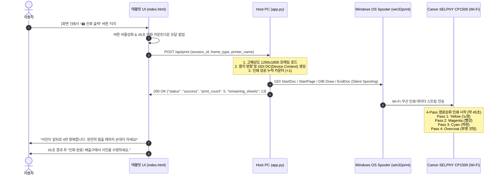

# {IoT 연동} 개발기획서: Canon SELPHY CP1500 무선 네트워크 인화 시스템 구축

## 1. 기획 배경 및 추진 목적

### 1.1. 추진 배경
* 현재 포토부스 시스템은 스마트폰 카메라를 통한 **모바일 무선 QR 다운로드(사진/2배속 영상)**를 지원하고 있습니다.
* 그러나 오프라인 포토부스(인생네컷, 포토이즘 등)의 가장 핵심적인 사용자 경험은 **"손에 쥐어지는 고품질 실물 인화 사진(Physical Printout)"**입니다.
* 특히 본 프로젝트의 "인생 사계절(어린이-청소년-현재-노년)" 테마는 실물 소장 가치와 선물/기념 가치가 매우 높으므로, 현장에서 태블릿 터치 한 번으로 즉시 실물 인화가 이루어지는 IoT 인화기 연동이 필수적입니다.

### 1.2. 도입 목표
1. **선 없는 현장 무선 인화 (Wi-Fi Wireless Silent Print)**: 복잡한 케이블 연결 없이 태블릿 ➔ Host PC ➔ Canon CP1500으로 이어지는 무선 네트워크 인화 파이프라인 구축.
2. **표준 엽서 4x6인치 듀얼 스트립(2x6인치 2분할) 구현**: 엽서 1장에 좌우 동일한 4컷 스트립 2장을 배치하고 중앙 절취 점선을 포함하여, 2인이 1장씩 나눠 가질 수 있는 오리지널 인생네컷 감성 제공.
3. **염료승화형 4-Pass 출력 특성에 최적화된 UX**: 41~45초 동안 사진이 앞뒤로 4번 왕복(노랑 ➔ 빨강 ➔ 파랑 ➔ 코팅)하는 하드웨어 특성을 반영한 인터랙티브 안내 모달 및 안전 수칙 제공.
4. **18매 용지 카세트 관리 기능**: 대여 및 현장 운용 특성을 고려하여 18매 단위 용지 소진을 사전에 감지하고 교체 알림을 주는 카운터 시스템 탑재.

---

## 2. 하드웨어 스펙 및 물리적 특성 분석 (Canon SELPHY CP1500)

참고 링크: [SLRRENT - Canon SELPHY CP1500 사양](https://www.slrrent.com/m/camera/view.php?idx=2181)

| 항목 | 상세 사양 | 포토부스 개발 시 시사점 |
| :--- | :--- | :--- |
| **인쇄 방식** | 염료승화형 열전사 방식 (Dye-Sublimation) | 잉크 노즐 막힘이 없고, 오버코트 라미네이팅으로 물/지문/빛에 강해 100년 보존 가능 |
| **인쇄 해상도** | 300 x 300 DPI (256 계조/색, 1,677만 색상) | 이미지 해상도를 **300 DPI 기준 픽셀(1200 x 1800 px)**로 정확히 맞춰야 뭉개짐/계단현상 없음 |
| **출력 용지** | 엽서(Postcard) 사이즈 (KP-36IP / RP-108 등)<br>100 x 148 mm (약 4 x 6 인치) | 2:3 비율 규격. 기존 웹용 3:4(900x1200) 프레임 대신 **1200x1800 엽서 전용 프레임** 필수 |
| **인쇄 속도** | 엽서 사이즈 1매당 **약 41초 ~ 45초** | 사용자가 지루함을 느끼지 않도록 45초 카운트다운 타이머 및 하드웨어 왕복 안내 제공 |
| **용지 카세트 용량** | 엽서 카세트(PCP-CP400) **최대 18매 적재** | 18매 출력 시마다 용지/카트리지 교체 필요 ➔ 인쇄 카운터(15매 이상 시 경고) 필수 |
| **네트워크 인터페이스** | Wi-Fi (IEEE 802.11b/g, 2.4GHz) | 동일 Wi-Fi 서브넷 내에서 Windows 프린터 스풀러(`win32print`) 무선 통신 완벽 지원 |
| **인쇄 물리 동작** | 용지가 앞뒤로 **4회 왕복** 배출 | 출력 중 용지를 당기거나 막으면 기기 기어 파손 발생 ➔ 모달에 "손대지 마세요" 경고 필수 |

---

## 3. 통신 아키텍처 및 네트워크 환경 세팅

### 3.1. 통신 흐름 다이어그램



### 3.2. 현장 네트워크 구성 방식 (택 1)

* **방법 A (강력 권장 - 외부 유무선 공유기 활용)**:
  - 현장에 소형 유무선 공유기(iptime 등)를 설치하고, **Host PC, 태블릿, Canon CP1500**을 모두 같은 2.4GHz Wi-Fi SSID에 접속시킵니다.
  - 외부 인터넷 신호 간섭이 적고, 대량 인쇄 시 패킷 전송이 가장 안정적입니다.
* **방법 B (단독 운용 - Windows 모바일 핫스팟 활용)**:
  - Host PC(노트북)의 Windows 설정에서 **[모바일 핫스팟]**을 켭니다 (대역: 2.4GHz).
  - 태블릿과 CP1500 본체 Wi-Fi 설정에서 노트북 핫스팟 SSID로 연결합니다.
  - 외부 공유기 장비가 없을 때 매우 경제적이고 독립적으로 동작합니다.

### 3.3. Windows 프린터 드라이버 세팅 가이드
1. 캐논 코리아 다운로드 센터에서 **[SELPHY CP1500 프린터 드라이버 (Windows)]** 공식 설치.
2. 설치 시 연결 방식을 **[네트워크 / 무선 LAN 연결]**로 선택 후 동일 Wi-Fi에 연결된 CP1500을 자동 검색하여 등록.
3. Windows [설정] ➔ [프린터 및 스캐너] ➔ [Canon SELPHY CP1500] ➔ [인쇄 기본 설정]:
   - **용지 크기**: `엽서 (100 x 148 mm)`
   - **테두리 설정**: `테두리 없음 (Borderless)`
   - **인쇄 방향**: `세로 (Portrait)`

---

## 4. 인화 프레임 레이아웃 상세 기획 (300 DPI 엽서 규격)

### 4.1. 해상도 및 규격 사양
* **캔버스 픽셀 크기**: **$1200 \times 1800\text{ px}$** (4 x 6인치 @ 300 DPI, 2:3 비율)
* **2분할 듀얼 스트립(2x6인치) 구조**:
  - 가로폭 1200px를 정확히 절반인 600px씩 2개의 독립된 스트립으로 분할.
  - 좌측 스트립(0~600px)과 우측 스트립(600~1200px)에 완전히 동일한 4컷 사진 및 브랜딩 로고를 나란히 렌더링.
  - 정중앙(x = 600px)에 **연한 회색 절취 안내 점선(Cutting Guide Line)**을 인쇄하여 가위나 작두칼로 손쉽게 2장으로 분리 가능.

```
┌─────────────────────────── 1200 px ───────────────────────────┐
│              좌측 스트립 (600px)  ┆  우측 스트립 (600px)              │
│  ┌─────────────────────────────┐ ┆ ┌─────────────────────────────┐  │
│  │   [1컷] 유년기 (어린이)     │ ┆ │   [1컷] 유년기 (어린이)     │  │
│  └─────────────────────────────┘ ┆ └─────────────────────────────┘  │
│  ┌─────────────────────────────┐ ┆ ┌─────────────────────────────┐  │
│  │   [2컷] 청소년기 (교복)     │ ┆ │   [2컷] 청소년기 (교복)     │  │
│  └─────────────────────────────┘ ┆ └─────────────────────────────┘  │
│  ┌─────────────────────────────┐ ┆ ┌─────────────────────────────┐  │
│  │   [3컷] 현재 본연의 모습    │ ┆ │   [3컷] 현재 본연의 모습    │  │ 1800 px
│  └─────────────────────────────┘ ┆ └─────────────────────────────┘  │
│  ┌─────────────────────────────┐ ┆ ┌─────────────────────────────┐  │
│  │   [4컷] 노년기 (황혼)       │ ┆ │   [4컷] 노년기 (황혼)       │  │
│  └─────────────────────────────┘ ┆ └─────────────────────────────┘  │
│     AI 4-CUT (TIME TRAVEL)       ┆    AI 4-CUT (TIME TRAVEL)        │
│   MEMORY PHOTO • 2026.09.07      ┆  MEMORY PHOTO • 2026.09.07       │
│                                  ┆ (중앙 절취 점선)                 │
└──────────────────────────────────┴───────────────────────────┘
```

### 4.2. 포토 슬롯 치수 및 비율 최적화
* 스트립 너비: 600px
* 좌우 여백: 각 50px ➔ 사진 가로폭: **$500\text{ px}$**
* 사진 세로 높이: **$340\text{ px}$** (인물 중심의 세로형 4컷 배치에 최적화, 약 3:2.04 비율)
* 컷 간격(Gap): **$22\text{ px}$**, 상단 여백: **$55\text{ px}$**
* 하단 여백: **$240\text{ px}$** (브랜드명, 촬영 일시, 타임스탬프 영문 폰트 렌더링)

---

## 5. 사용자 경험(UX) 및 하드웨어 보호 기획

### 5.1. 45초 인쇄 대기 심리적 지연 해소 & 장비 고장 방지
* 셀피 CP1500은 인쇄 도중 용지가 프린터 앞뒤로 약 10cm 이상 4차례 왕복 배출됩니다.
* 이용자가 사진이 다 나온 줄 알고 손으로 잡아당기면 **프린터 기어와 롤러가 파손**됩니다.
* **대응책**:
  1. 인화 버튼 클릭 시 즉시 화면에 **대형 주의 모달** 노출.
  2. 노랑 ➔ 빨강 ➔ 파랑 ➔ 코팅 4단계를 시각적으로 보여주는 **4-Pass 진행 애니메이션**.
  3. **"⚠️ 주의: 사진이 앞뒤로 4번 왕복합니다! 완전히 멈추고 트레이에 안착할 때까지 절대 손대지 마세요."** 문구를 점멸 강조.
  4. 45초 타이머 종료 시 팡파르 애니메이션과 함께 "사진이 성공적으로 인화되었습니다" 안내.

### 5.2. 트레이 18매 카운터 관리
* CP1500 전용 카세트는 최대 18매의 인화지를 수용합니다.
* 백엔드(`app.py`)에 세션 독립적인 누적 인쇄 카운터(`PRINT_COUNTER`)를 유지:
  - 1회 출력 시마다 `PRINT_COUNTER += 1`
  - 현재 카세트 잔여 매수: `18 - (PRINT_COUNTER % 18)`
  - 잔여 매수가 3매 이하(15매 이상 출력)일 경우:
    - 백엔드 콘솔 로그에 `[Printer Alert] ⚠️ 인화지 잔량 부족 (잔여 3매 이하)! 카세트 용지와 카트리지를 확인하세요.` 출력.
    - `/api/print` 응답에 `warning: "low_paper"` 플래그를 내려보내 태블릿 상단에 관리자용 안내 배지 표시.

---

## 6. 개발 범위 및 마일스톤

| 단계 | 작업 내용 | 결과물 |
| :---: | :--- | :--- |
| **1단계** | 1200x1800 300DPI 엽서 규격 프레임 생성기 구현 | `concept_transformer.py` (`create_4cut_frame_postcard`) |
| **2단계** | Windows GDI Spooler 기반 무선 Silent Print 백엔드 API 신설 | `app.py` (`POST /api/print`, 프린터 자동감지, 18매 카운터) |
| **3단계** | 키오스크 태블릿 UI 연동 및 45초 4-Pass 안전 모달 구현 | `index.html`, `style.css` (45초 타이머, 안전 경고 애니메이션) |
| **4단계** | 무선 LAN 환경 통합 통신 및 인쇄 품질 실차 테스트 | 최종 동작 검증 및 운영 매뉴얼 업데이트 |
