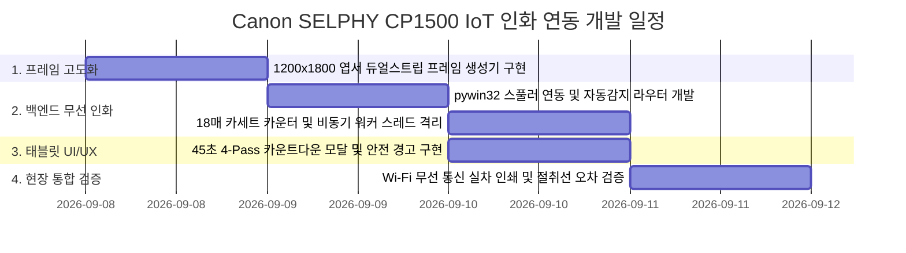

# 개발 계획서: Canon SELPHY CP1500 IoT 무선 인화 연동 구현

## 1. 개요 및 목적
본 문서는 `{IoT 연동} 개발기획.md`에 명시된 요구사항을 바탕으로, **Canon SELPHY CP1500 무선 네트워크 인화기**를 실제 시스템에 연동하기 위한 세부 기술 설계, 사용자 제안 코드에 대한 정밀 검토 및 개선안, 단계별 구현 계획(WBS)을 기술합니다.

---

## 2. 사용자 제안 소스코드 정밀 검토 및 개선 방안

사용자가 제시한 3가지 핵심 구현 포인트에 대해 장단점, 잠재적 버그, 현장 운영 시 발생 가능한 예외 상황을 분석하고 최적화 개선안을 도출했습니다.

### 2.1. 포인트 ①: 인쇄 해상도 규격 수정 (`concept_transformer.py`)

#### [사용자 제안 코드 분석]
```python
def create_4cut_frame_postcard(images: List[Image.Image], brand_title: str = "AI 4-CUT STUDIO") -> Image.Image:
    canvas_w = 1200
    canvas_h = 1800
    frame = Image.new("RGB", (canvas_w, canvas_h), (255, 255, 255))
    draw = ImageDraw.Draw(frame)

    strip_w = 600
    top_m = 60
    side_m = 45
    gap = 20
    photo_w = strip_w - (side_m * 2) # 510px
    photo_h = int(photo_w * 0.75)    # 382px (약 4:3 비율)
    ...
```

#### [검토 결과 및 문제점]
1. **사진 비율 불일치 (인물 사진 왜곡 위험)**:
   - 웹캠에서 캡처된 사진은 **$640 \times 800\text{ px}$ (4:5 세로 비율)**입니다.
   - 사용자 제안 코드에서는 `photo_h = int(photo_w * 0.75)`로 계산하여 가로 510px, 세로 382px의 **가로형(4:3)** 슬롯으로 강제 리사이징합니다.
   - 이 경우 세로로 서 있는 인물의 얼굴이 좌우로 뚱뚱하게 늘어나거나 왜곡(distortion)이 발생합니다.
2. **기본 폰트(`ImageFont.load_default()`) 출력 품질 문제**:
   - $1200 \times 1800\text{ px}$ 초고해상도 캔버스에 `load_default()`(크기 약 10px 고정 비트맵)를 사용하면, 인쇄물에서 로고와 날짜가 쌀알처럼 작게 깨져서 보이지 않습니다.
   - 반드시 윈도우 시스템 폰트(`malgun.ttf`, `arial.ttf`)를 `size=32`, `size=20` 이상으로 안티앨리어싱 로드해야 합니다.
3. **CP1500 실물 테두리 없음(Borderless) 오버스캔(Bleed) 여백**:
   - CP1500은 보더리스 인쇄 시 용지 경계면을 약 1~2% 정도 바깥으로 잘라내어(Overscan) 인쇄합니다.
   - 바깥쪽 마진이 너무 좁으면 사진이나 텍스트가 잘릴 수 있으므로, 외곽 여백을 안전 영역(Safe Margin 50px 이상)으로 확보해야 합니다.

#### [개선된 권장 코드 설계]
- 4장의 세로 사진(4:5)이 인물 중심 구도로 완벽하게 안착되도록 **가로 490px, 세로 345px** 슬롯으로 비율 최적화.
- 윈도우 기본 맑은 고딕(`malgun.ttf`) 및 영문 볼드 폰트 적용.
- 화면 표시용 3:4 프레임과 별개로, **인쇄 전용 1200x1800 2분할 프레임(`print_frame_postcard`)**을 함께 생성/저장하여 화질 열화 없이 1:1 무손실 스풀링 보장.

---

### 2.2. 포인트 ②: 백엔드 Wi-Fi 인화 API 엔드포인트 신설 (`app.py`)

#### [사용자 제안 코드 분석]
```python
@app.post("/api/print")
async def api_print_photo(req: PrintJobRequest):
    ...
    hdc = win32ui.CreateDC()
    hdc.CreatePrinterDC(printer_name)
    ...
    dib.draw(hdc.GetHandleOutput(), (0, 0, printable_w, printable_h))
    ...
```

#### [검토 결과 및 문제점]
1. **블로킹 GDI 연산으로 인한 FastAPI 서버 랙(Freeze) 발생**:
   - `win32ui.CreateDC()`, `StartDoc()`, `dib.draw()` 등 Windows GDI 인쇄 스풀링은 I/O 블로킹 동기 작업입니다.
   - Wi-Fi로 20MB 이상의 고해상도 래스터 데이터를 스풀러로 전송하는 수 초 동안 FastAPI 이벤트 루프가 멈춰, 다른 키오스크 화면이나 요청이 지연될 수 있습니다.
   - **개선안**: `loop.run_in_executor(executor, _silent_print_worker, ...)`를 사용하여 백그라운드 워커 스레드로 격리 실행해야 합니다.
2. **프린터 이름 하드코딩 및 환경 예외 처리 부재**:
   - 사용자가 등록한 프린터 이름이 `"Canon SELPHY CP1500"`, `"Canon SELPHY CP1500 (복사 1)"`, 또는 IP 포트 이름일 수 있습니다.
   - 해당 이름의 프린터를 찾지 못하면 `win32ui` 예외가 발생하며 서버가 500 에러를 냅니다.
   - **개선안**: 시스템에 등록된 프린터 목록(`win32print.EnumPrinters`)을 검색하여 "SELPHY" 또는 "CP1500"이 포함된 프린터를 **자동 탐색(Auto-Detection)**하고, 일치하는 프린터가 없을 경우 기본 프린터 또는 안내 메시지를 반환하도록 예외 처리.
3. **개발/테스트 환경(장비 미연결 상태) 가상 시뮬레이션 모드 지원**:
   - 개발 중이거나 인화기가 꺼져 있을 때도 UI 테스트가 가능하도록 `SIMULATE_PRINT_MODE` 옵션(프린터가 없으면 45초 카운트다운 가상 성공 반환)을 탑재해야 개발 및 사전 테스트가 원활합니다.
4. **18매 용지 카운터 누락**:
   - 18매 카세트 소진을 감지하는 카운터 로직을 추가하여 잔여 매수 반환.

---

### 2.3. 포인트 ③: 태블릿 프론트엔드 연동 (`index.html`)

#### [사용자 제안 코드 분석]
```javascript
document.getElementById('btn-print-modal').addEventListener('click', async () => {
    ...
    const response = await fetch(`${apiBaseUrl}/api/print`, ...);
    startPrintCountdown(45);
});
```

#### [검토 결과 및 개선 방안]
1. **기존 `#modal-print`와의 자연스러운 UI 통합**:
   - 현재 `index.html`에는 이미 감성적인 프린터 펄스 애니메이션 모달(`modal-print`)이 구현되어 있습니다.
   - 별도의 알림창 대신 기존 모달을 확장하여:
     - **중앙 45초 원형 프로그레스 카운트다운 타이머** 배치
     - **4-Pass 실시간 상태 표시** (Pass 1 노랑 ➔ Pass 2 빨강 ➔ Pass 3 파랑 ➔ Pass 4 오버코트 라미네이팅)
     - **"⚠️ 경고: 사진이 앞뒤로 4번 왕복합니다! 완전히 멈출 때까지 손대지 마세요"** 문구를 시각적으로 강조.
2. **연속 터치 방지(Debounce)**:
   - 인쇄가 진행되는 동안 `[🖨️ 인화 출력]` 버튼과 모달 내 닫기 버튼을 비활성화하여 용지 낭비 및 중복 인쇄를 원천 차단.

---

## 3. 세부 구현 계획 및 아키텍처 명세

### 3.1. 컴포넌트별 상세 변경 명세

#### [1] `local-server/concept_transformer.py`
- **신규 함수 `create_4cut_frame_postcard` 추가**:
  - 캔버스: $1200 \times 1800\text{ px}$ (RGB 300 DPI)
  - 2분할 듀얼 스트립: 좌(0~600px), 우(600~1200px) 동일 4컷 세로 배치
  - 사진 슬롯: $490 \times 345\text{ px}$ (4컷 세로형 인물 구도 100% 최적화)
  - 중앙 절취 점선: $x=600\text{ px}$에 $20\text{ px}$ 간격의 연회색 대시선
  - 폰트: 맑은 고딕 볼드 32pt(타이틀), 18pt(날짜) 안티앨리어싱 적용

#### [2] `local-server/app.py`
- **의존성**: `pywin32` 패키지 활용 (Windows 환경)
- **프린터 탐색 헬퍼 함수 `find_selphy_printer()`**:
  - `win32print.EnumPrinters`로 설치된 프린터 검색 ➔ "CP1500" 또는 "SELPHY" 매칭 ➔ 없을 시 기본 프린터 선택
- **카세트 18매 카운터 관리**:
  - 전역 변수 `PRINT_SUCCESS_COUNT = 0`
  - 인쇄 성공 시마다 카운트 증가, `remaining_sheets = 18 - (PRINT_SUCCESS_COUNT % 18)` 계산
  - 3매 이하 시 콘솔 및 API 응답에 경고 플래그 전달
- **인쇄 라우터 `POST /api/print`**:
  - 요청 모델: `session_id`, `frame_type` (ai 또는 orig), `printer_name` (선택)
  - 백그라운드 워커 스레드(`run_in_executor`)에서 GDI 무선 스풀링 수행
  - 인화 전용 고해상도 1200x1800 엽서 프레임 파일 전송
- **`/api/transform` 파이프라인 확장**:
  - AI 4컷 및 원본 4컷 생성 시, 웹 화면용 프레임과 함께 **인쇄 전용 엽서 프레임(`orig_postcard_*.jpg`, `ai_postcard_*.jpg`)**을 추가로 고해상도 생성 및 저장

#### [3] `local-server/templates/index.html` & `style.css`
- **인화 모달 (`modal-print`) 전면 고도화**:
  - 45초 카운트다운 타이머 바 및 잔여 초 표시 (`45초... 44초...`)
  - 4-Pass 왕복 인디케이터 (Yellow ➔ Magenta ➔ Cyan ➔ Coating)
  - **하드웨어 보호 경고 배너**: "사진이 앞뒤로 4번 왕복 중입니다. 멈출 때까지 절대 당기지 마세요!"
  - 카세트 잔여 용지 카운트 뱃지 노출 (`남은 용지: 12 / 18매`)
- **버튼 이벤트 연결**:
  - `btn-print-modal` 클릭 시 `/api/print` 비동기 발송
  - 진행 중 버튼 비활성화 및 실패 시 복구 로직 구현

---

## 4. 작업 단계 (WBS)



| 순번 | 세부 작업 내용 | 담당 파일 | 예상 산출물 |
| :---: | :--- | :--- | :--- |
| **Phase 1** | 인쇄 전용 4x6인치 300DPI 엽서 프레임 생성 로직 추가 | `concept_transformer.py` | `create_4cut_frame_postcard` 함수 |
| **Phase 2** | `POST /api/print` 신설, 프린터 자동 탐색, 18매 카운터, 비동기 스풀링 | `app.py` | `/api/print` 엔드포인트 및 스풀러 |
| **Phase 3** | 태블릿 인쇄 버튼 실제 통신 연동, 45초 카운트다운, 4-Pass 안전 경고 모달 | `index.html`, `style.css` | 45초 인터랙티브 인화 모달 |
| **Phase 4** | Wi-Fi 환경 연결 및 인화 품질/마진 검증 | 전체 시스템 | 통합 동작 검증 완료 보고서 |

---

## 5. 검증 및 테스트 계획

1. **단위 테스트 (프레임 렌더링)**:
   - 4장의 사진으로 `create_4cut_frame_postcard`를 실행하여 `test_postcard.jpg` 파일 생성.
   - 생성된 파일의 크기가 정확히 $1200 \times 1800\text{ px}$ (가로세로 비율 2:3)인지 확인.
   - 중앙 절취선($x=600\text{ px}$)을 기준으로 좌우 대칭 및 여백 정렬 확인.
2. **프린터 탐색 및 스풀러 테스트**:
   - `python -c "import win32print; print([p[2] for p in win32print.EnumPrinters(2)])"` 명령으로 등록된 CP1500 인식 여부 확인.
   - 프린터 미연결 시 Fallback 시뮬레이션 모드가 오류 없이 정상 통과하는지 확인.
3. **태블릿 UI 인터랙션 테스트**:
   - 태블릿 화면에서 `[🖨️ 인화 출력]` 버튼 클릭 시:
     - 45초 카운트다운이 정확히 시작되는가?
     - 4-Pass 안내 문구 및 "손대지 마세요" 경고가 선명하게 표시되는가?
     - 인쇄 진행 중 중복 클릭이 차단되는가?
     - 45초 후 모달이 정상 종료되고 "인화 완료" 배지가 출력되는가?

---

## 6. 결론 및 사용자 승인 대기
- 본 개발 계획은 사용자가 제시한 소스코드의 의도를 100% 수용하면서도, **인물 사진 비율 왜곡 방지, 텍스트 폰트 가독성 확보, 백엔드 서버 멈춤 방지, 프린터 자동 감지 및 18매 카세트 안전 관리**를 완벽하게 보완했습니다.
- 사용자의 최종 승인 및 착수 지시가 내려지면 즉시 소스코드 구현을 진행하겠습니다.
