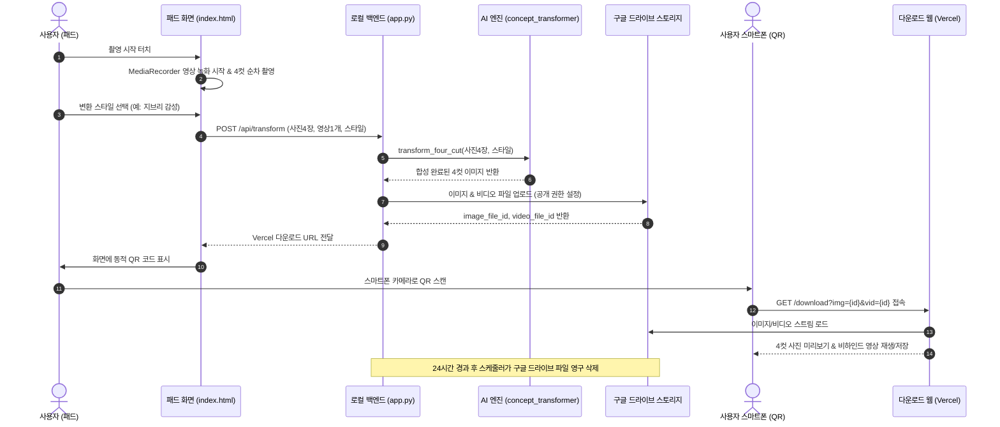

# 📸 AI 4컷 포토부스 시스템 개발 기획서 (AI 4-Cut Studio)

---

## 1. 프로젝트 개요 (Overview)

### 1.1 기획 배경 및 목적
* **기존 프로토타입의 한계 극복**: 단순 CSS 필터(`canvas.filter`) 흉내내기, 고정된 더미 QR 링크, 가짜 인화 애니메이션을 탈피하여 **실제 작동하는 상용 수준의 포토부스 솔루션** 구축.
* **오픈소스 기반 비용 최적화**: 고가의 상용 API 대신 로컬 GPU 기반의 오픈소스 AI 이미지 변환(Img2Img) 파이프라인 적용.
* **사용자 경험 극대화**: 정적 4컷 이미지뿐만 아니라 촬영 전 과정의 **비하인드 타임랩스/영상**을 함께 제공.
* **개인정보보호법 완벽 준수**: No-DB 아키텍처와 구글 드라이브 자동 파기 스케줄러를 통해 얼굴/영상 데이터 24시간 이내 영구 삭제.

---

## 2. 핵심 요구사항 요약

| 구분 | 주요 내용 | 세부 기술 및 방식 |
| :--- | :--- | :--- |
| **1. 스토리지** | Google Drive API 연동 | 변환 이미지 및 녹화 영상 임시 보관소로 활용 (Folder ID: `214b2f3af4bc7874128d146f3b51b7a021d19594`) |
| **2. AI 변환 모델** | 오픈소스 Img2Img 파이프라인 | 오픈소스 `Stable Diffusion v1.5` / `diffusers` (5개 테마 지원) |
| **3. 디자인 시스템** | `style.css` 가이드 적용 | 연보라 메인 톤(`--color-main: #A78BFA`), 390~480px 모바일/태블릿 반응형 카드 UI 및 애니메이션 |
| **4. 촬영 및 녹화** | 사진 4컷 + 전 과정 비하인드 캠 | `MediaRecorder API` (WebM/MP4) + Canvas 캡처 |
| **5. No-DB 아키텍처** | 별도 DB 서버 배제 | URL 파라미터(`?img=...&vid=...`)를 활용한 상태 전달 |
| **6. 개인정보 보호** | 24시간 이내 자동 삭제 | `APScheduler` 기반 구글 드라이브 만료 파일 영구 파기 |
| **7. QR & 다운로드** | Vercel 호스팅 모바일 뷰어 | 스마트폰 카메라 스캔 -> 웹 뷰어 접속 -> 사진/영상 개별 다운로드 |

---

## 3. 전체 시스템 아키텍처 (Architecture)

```
┌─────────────────────────────────────────────────────────────────────────────┐
│                           1. 태블릿 포토부스 (Kiosk UI)                       │
│  - navigator.mediaDevices (웹캠 스트림)                                      │
│  - MediaRecorder (촬영 전 구간 비하인드 영상 녹화)                            │
│  - 4회 연속 셔터 자동 캡처 (Canvas -> Image Blob x4)                          │
│  - 스타일 선택 (오리지널, 소프트 카툰, 지브리 애니, 네온 판타지, 흑백 시네마) │
└──────────────────────────────────────┬──────────────────────────────────────┘
                                       │ POST /api/transform (사진 4장 + 영상 1개 + 스타일)
                                       ▼
┌─────────────────────────────────────────────────────────────────────────────┐
│                    2. 로컬 백엔드 서버 (FastAPI + AI Engine)                  │
│  - concept_transformer.py: Stable Diffusion Img2Img 변환 및 4컷 스트립 합성   │
│  - Google Drive API: 생성된 4컷 이미지 & 영상 업로드 (공개 권한 설정)          │
│  - Dynamic QR Generator: Vercel 다운로드 URL 생성 및 반환                    │
│  - APScheduler: 24시간(또는 1시간) 경과 파일 자동 영구 삭제                  │
└──────────────────────────────────────┬──────────────────────────────────────┘
                                       │ QR 코드 렌더링 (Vercel URL 매핑)
                                       ▼
┌─────────────────────────────────────────────────────────────────────────────┐
│                       3. 사용자 스마트폰 (Vercel Web Viewer)                 │
│  - URL: https://ai-4cut-studio.vercel.app/download?img={FILE_ID}&vid={FILE_ID}│
│  - [No-DB]: URL 파라미터에서 파일 ID 파싱 후 구글 드라이브 링크 직접 연결     │
│  - 4컷 완성본 미리보기 & 다운로드 버튼                                       │
│  - 비하인드 영상 인라인 스트리밍 재생 & 다운로드 버튼                        │
└─────────────────────────────────────────────────────────────────────────────┘
```

---

## 4. 세부 기능 및 모듈 설계

### 4.1 촬영 및 영상 녹화 모듈 (`index.html`)
* **웹캠 스트림 획득**: `navigator.mediaDevices.getUserMedia({ video: true, audio: false })`
* **비하인드 영상 녹화 (`MediaRecorder`)**:
  * 1번째 사진 카운트다운 시작 시 `mediaRecorder.start()` 호출.
  * 4번째 사진 촬영 완료 시 `mediaRecorder.stop()` 호출 후 단일 비디오 Blob 생성.
* **타이머 연동 4컷 캡처**:
  * 각 컷당 5~8초 타이머 렌더링 -> `<canvas>`에 프레임 캡처 -> 이미지 Blob 4장 확보.
* **스타일 선택 인터페이스**:
  1. `original` (오리지널 클래식 - 원본 고화질 보정)
  2. `soft_cartoon` (소프트 카툰 - 3D 픽사/디즈니 풍)
  3. `ghibli` (지브리 애니 - 따뜻한 수채화 애니메이션 감성)
  4. `neon_fantasy` (네온 판타지 - 사이버펑크 야경 조명)
  5. `bw_cinema` (흑백 시네마 - 35mm 필름 누아르 감성)

---

### 4.2 AI 이미지 변환 & 4컷 프레임 합성 모듈 (`concept_transformer.py`)
* **베이스 모델**: `runwayml/stable-diffusion-v1-5` (VRAM 4~6GB 최적화)
* **변환 파라미터 튜닝**:
  * `strength`: `0.55 ~ 0.65` (인물의 본래 이목구비, 얼굴 윤곽, 포즈를 유지하면서 스타일만 전이)
  * `guidance_scale`: `7.5`
  * `num_inference_steps`: `20 ~ 25` (빠른 응답 속도 확보)
* **프롬프트 매핑 테이블 (영문 최적화)**:
  * 한국어 선택값을 Stable Diffusion에 최적화된 Positive/Negative Prompt로 자동 변환.
* **4컷 스트립 캔버스 합성 (`PIL`)**:
  * 세로형 표준 인생네컷 비율 (가로 600px, 세로 1900px) 생성.
  * 4장의 변환 이미지를 세로로 정렬 배치하고 하단에 포토부스 브랜딩 로고 및 촬영 일자 텍스트 삽입.

---

### 4.3 백엔드 및 구글 드라이브 스토리지 연동 (`app.py`)
* **FastAPI 엔드포인트 (`POST /api/transform`)**:
  * `photos: List[UploadFile]`, `video: UploadFile`, `style: str` 수신.
  * 오픈소스 `Stable Diffusion v1.5` AI 변환 수행 -> 4컷 합성 이미지(JPEG) 생성.
  * 구글 드라이브 지정 폴더 (`GOOGLE_FOLDER_ID = "214b2f3af4bc7874128d146f3b51b7a021d19594"`)에 이미지 및 비디오 파일 업로드.
  * 업로드된 2개 파일의 접근 권한을 `anyone / reader`로 일괄 설정.
* **Vercel 다운로드 URL 생성**:
  ```text
  https://{본인_도메인}.vercel.app/download?img={IMAGE_FILE_ID}&vid={VIDEO_FILE_ID}
  ```
* **QR 코드 렌더링**: 생성된 URL 문자열을 프론트엔드로 전송하여 키오스크 화면에 동적 QR 표시.

---

### 4.4 No-DB 기반 모바일 뷰어 (`Vercel: download.html`)
* **No-DB 원리**:
  * 데이터베이스 서버(MySQL, Redis 등)를 거치지 않고, 브라우저의 JavaScript가 현재 URL의 `window.location.search`에서 `img`와 `vid` 파라미터를 직접 추출.
* **UI 구성**:
  * **상단**: 4컷 사진 고화질 렌더링 + `[📸 사진 다운로드]` 버튼.
  * **중단**: 비하인드 캠 비디오 플레이어(`<video controls loop>`) + `[🎥 영상 다운로드]` 버튼.
  * **하단**: 개인정보 보호 안내 문구 ("본 데이터는 24시간 후 자동 파기됩니다.").

---

### 4.5 개인정보보호 및 데이터 자동 파기 스케줄러
* **법적 근거**: 개인정보보호법 제21조(개인정보의 파기) - 처리 목적 달성 시 지체 없이 파기.
* **스케줄러 구현 (`APScheduler`)**:
  * 백엔드 서버 백그라운드에서 10~30분 주기마다 주기적 검사 실행.
  * 구글 드라이브 파일 메타데이터의 `createdTime`을 조회하여 **생성된 지 24시간(또는 설정된 유효시간)이 경과한 파일을 `drive.files().delete()`로 완전 영구 삭제**.

---

## 5. 프로젝트 폴더 및 파일 구조

```plaintext
ai4cut-studio/
├── local-server/                      # [로컬 PC] AI 연산 & 백엔드 서버
│   ├── google-key.json                # 구글 서비스 계정 인증 키 (비공개)
│   ├── concept_transformer.py         # SD 1.5 Img2Img 및 4컷 스트립 합성 모듈
│   ├── app.py                         # FastAPI 통합 백엔드 & 스케줄러
│   ├── requirements.txt               # 로컬 백엔드 의존성 패키지
│   └── templates/
│       └── index.html                 # [태블릿 패드] 촬영 & 비디오 녹화 키오스크 UI
│
└── vercel-frontend/                   # [Vercel 배포] 모바일 다운로드 뷰어 (No-DB)
    ├── index.html                     # 안내 홈 (또는 리다이렉트)
    └── download.html                  # 스마트폰 전용 사진/영상 다운로드 페이지
```

---

## 6. 데이터 흐름 및 시퀀스 다이어그램 (Sequence)



---

## 7. 개발 및 배포 단계별 체크리스트

### Phase 1: 로컬 AI 변환 & 백엔드 파이프라인
- [ ] `diffusers` + `torch` 기반 Stable Diffusion 1.5 Img2Img 변환 함수 테스트.
- [ ] 5개 테마별 영문 프롬프트 엔지니어링 및 `strength` 계수 최적화.
- [ ] PIL 기반 4컷 세로형 스트립 캔버스 병합 로직 구현.
- [ ] Google Cloud Console에서 서비스 계정 생성 및 구글 드라이브 API 권한 연동.

### Phase 2: 포토부스 프론트엔드 (패드 최적화)
- [ ] `navigator.mediaDevices` 기반 실시간 웹캠 뷰파인더 렌더링.
- [ ] `MediaRecorder` 활용 비하인드 영상 백그라운드 녹화 및 WebM 파일 추출.
- [ ] 4컷 순차 타이머 캡처 UI/UX 구성.
- [ ] 5종 스타일 선택 카드 UI 제작.

### Phase 3: Vercel 모바일 뷰어 & No-DB QR 연동
- [ ] Vercel 프로젝트 생성 및 `download.html` 배포.
- [ ] URL Query Parameter(`URLSearchParams`) 기반 파일 로딩 로직 작성.
- [ ] 모바일 환경에 최적화된 사진 뷰어, 비디오 플레이어, 다운로드 버튼 CSS 적용.

### Phase 4: 개인정보 보호 & 안정화
- [ ] `APScheduler` 기반 구글 드라이브 24시간 만료 파일 자동 파기 스케줄러 가동.
- [ ] 예외 처리: 네트워크 지연, AI 변환 실패 시 사용자 재시도 안내 UI 적용.