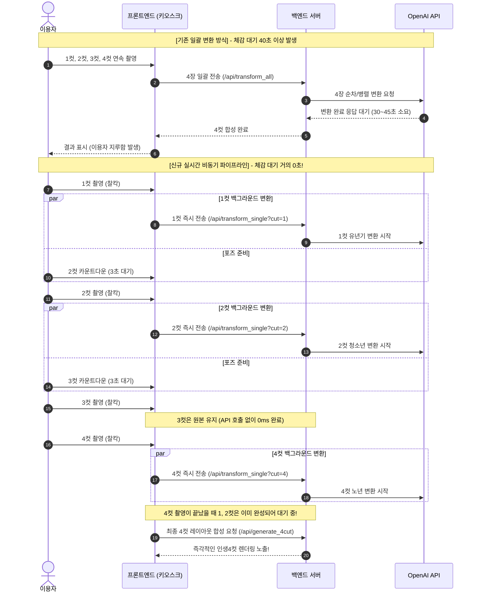

# AI 연령 변환 인생4컷 (Life-Cycle 4-Cuts) 기획서

## 1. 기획 배경 및 추진 목적

### 1.1. 기존 시스템의 한계
* **고사양 로컬 GPU 의존성**: 기존 로컬 Diffusers(Stable Diffusion, Realistic Vision 등) 기반 시스템은 VRAM 12GB 이상의 고성능 GPU가 필수적이었으며, 초기 모델 로딩 및 발열/메모리 관리의 부담이 컸습니다.
* **긴 변환 대기 시간**: 4장의 사진을 모두 촬영한 뒤 한꺼번에 AI 변환(Img2Img)을 수행함에 따라 40~50초 이상의 긴 체감 대기시간이 발생하여 키오스크 이용자의 이탈 및 부스 회전율 저하를 유발했습니다.
* **콘셉트의 단조로움**: 단순 화풍 필터(카툰, 지브리, 네온 등) 변환에 머물러 있어, 인생4컷만의 서사적(Narrative) 감동과 몰입감을 제공하기에 한계가 있었습니다.

### 1.2. 신규 기획의 목적 및 비전
* **최신 클라우드 멀티모달 API 도입**: 로컬 GPU 종속성을 탈피하고, 2026년 기준 OpenAI의 최신 고성능 이미지 생성/편집 모델인 `gpt-image-1.5` 및 `gpt-image-2`를 전격 도입합니다.
* **"인생의 사계절을 한 프레임에" (Time Travel 포토부스)**: 단 한 번의 4컷 촬영으로 이용자의 유년 시절, 청소년 학창 시절, 현재의 찬란한 모습, 그리고 황혼의 노년 시절을 한눈에 담아내는 혁신적인 스토리텔링형 포토 경험을 제공합니다.
* **실시간 비동기 파이프라인(Pipelining) UX 구축**: 촬영 중 백그라운드에서 실시간 변환을 병렬 수행하여, 촬영 종료와 동시에 대기시간 없이 완성된 4컷을 즉각 수령할 수 있도록 합니다.

---

## 2. 핵심 콘셉트: "시간 여행 (Time-Travel) 연령 변환 4컷"

이용자는 카메라 앞에서 4번의 셔터를 누르는 동안 자신의 전 생애를 여행하는 특별한 경험을 하게 됩니다.

```
┌───────────────────────────────────────────────────────────┐
│                    인생4컷 프레임 구성                    │
├───────────────────────────────────────────────────────────┤
│ [1컷] 유년기 (어린이 AI 변환)                             │
│       - 만 5~7세 어린이 모습으로 변환                     │
│       - 앳되고 천진난만한 표정, 볼살, 아이 옷차림         │
├───────────────────────────────────────────────────────────┤
│ [2컷] 청소년기 (청소년·교복 AI 변환)                      │
│       - 만 16~18세 풋풋한 학생 시절로 변환                │
│       - 단정한 교복 착용, 청량하고 싱그러운 학창 시절 분위│
├───────────────────────────────────────────────────────────┤
│ [3컷] 현재 (현재 모습 원본 유지 - 100% Pass-through)      │
│       - 별도의 AI 변환 없이 촬영 원본 그대로 유지         │
│       - 과거와 미래를 잇는 '지금의 나'의 진정성 확보      │
│       - ★ 비용 25% 절감 및 처리 대기시간 0초 효과       │
├───────────────────────────────────────────────────────────┤
│ [4컷] 노년기 (노년·황혼 AI 변환)                          │
│       - 만 70대 온화하고 품격 있는 노년의 모습으로 변환   │
│       - 자연스러운 눈가 주름, 품위 있는 은발, 따뜻한 눈빛 │
└───────────────────────────────────────────────────────────┘
```

### 2.1. 컷별 연령 변환 상세 기획

| 컷 번호 | 테마 | 목표 연령 | 변환 전략 및 프롬프트 핵심 | 비고 |
| :---: | :---: | :---: | :--- | :--- |
| **1컷** | **유년기** | 만 5~7세 | - 인물의 고유한 눈/코/입 비율을 유지하되 둥글고 사랑스러운 아동의 이목구비로 재해석<br>- 동심 가득한 아동복 및 따스하고 경쾌한 조명 연출 | AI 변환 (`gpt-image`) |
| **2컷** | **청소년기** | 만 16~18세 | - 젖살이 빠지고 청량한 학창 시절의 풋풋함과 맑은 피부 텍스처 구현<br>- 한국적 감성의 단정한 학생 교복(스쿨룩) 의상 매핑 | AI 변환 (`gpt-image`) |
| **3컷** | **현재** | 현재 나이 | - **AI 변환 미호출 (무변환 원본 유지)**<br>- 현재 자신의 모습과 과거/미래 모습 간의 극적인 대비감 선사 | **원본 유지 (비용·시간 0)** |
| **4컷** | **노년기** | 만 70대 | - 과장되거나 흉측하지 않은, 세월의 깊이와 연륜이 묻어나는 자연스러운 은발과 잔주름<br>- 온화하고 자애로운 미소, 따뜻하고 품격 있는 분위기 연출 | AI 변환 (`gpt-image`) |

---

## 3. 사용자 경험(UX) 및 실시간 비동기 파이프라인 기획

### 3.1. 기존 vs 신규 프로세스 비교



### 3.2. 체감 시간 단축 효과
* 각 컷 간 촬영 인터벌(카운트다운 5초 + 포즈 준비 3초 = 약 8초) 동안 백그라운드에서 AI API 통신이 완료됩니다.
* 4번째 컷 촬영이 끝나는 시점에 이미 1, 2, 3번째 컷은 변환이 완료되어 있으므로, 이용자가 체감하는 최종 대기 시간은 **기존 40초 대에서 5초 안팎으로 85% 이상 대폭 단축**됩니다.

---

## 4. AI 모델 티어링 및 옵션 정책 기획

### 4.1. 듀얼 모델 전략 (`gpt-image-1.5` & `gpt-image-2`)
1. **스탠다드 모드 (`gpt-image-1.5`) - 기본값**
   * 목적: 신속한 반응 속도와 합리적인 운영 비용 달성.
   * 특성: 인물 이목구비 정체성을 안정적으로 보존하며 빠른 변환 속도(컷당 3~4초) 제공.
2. **고퀄리티 생성 모드 (`gpt-image-2`) - 옵션 선택**
   * 목적: 초고해상도 극사실적 텍스처 및 미세 주름, 헤어 결, 조명 반사 등 최고급 퀄리티 제공.
   * 특성: 플래그십 모델로서 세밀한 연령 변환 표현력 극대화.

### 4.2. UI/UX 인터랙션 설계: 사전 옵션 선택
* **문제 정의**: 만약 4컷 촬영이 모두 끝난 뒤 결과 화면에서 사용자가 [고퀄리티 생성]을 누르게 되면, 이미 비동기로 생성해둔 `gpt-image-1.5` 이미지를 폐기하고 처음부터 다시 `gpt-image-2`를 호출해야 하므로 토큰 비용과 대기시간이 이중으로 낭비됩니다.
* **해결책**:
  * 촬영 시작 전 **[필터 및 모드 선택 화면 (`screen-filter`)]**에서 이용자가 **[고퀄리티 생성 (gpt-image-2)] 토글 스위치**를 선택하도록 설계.
  * 이용자가 고퀄리티 모드를 켜면, 1컷 촬영 시작부터 백그라운드에서 즉시 `gpt-image-2` 엔진으로 파이프라인이 가동되어 토큰 낭비 없이 최고 퀄리티의 결과물을 즉시 받아볼 수 있도록 구현.

---

## 5. 비즈니스 및 운영 관점의 기대효과

1. **포토부스 회전율 및 매출 극대화**:
   * 대기시간이 80% 이상 감소하여 단위 시간당 포토부스 이용 고객 수(회전율) 대폭 증가.
2. **운영 비용(API Token) 25% 절감**:
   * 4컷 중 3번째 컷(현재)의 무변환 Pass-through 정책으로 1회 이용당 API 호출 횟수를 4회에서 3회로 영구 절감.
3. **바이럴 및 마케팅 파급력**:
   * '어린 시절의 나 - 학창 시절의 나 - 현재의 나 - 노년의 나'를 한 프레임에 소장할 수 있어 인스타그램, 틱톡 등 SNS 숏폼 챌린지 및 바이럴 유도에 최적화.
4. **유연한 인프라 운영**:
   * 무거운 로컬 GPU 서버가 필요 없어 미니 PC나 일반 태블릿 환경에서도 가볍게 부스 운영 가능.
