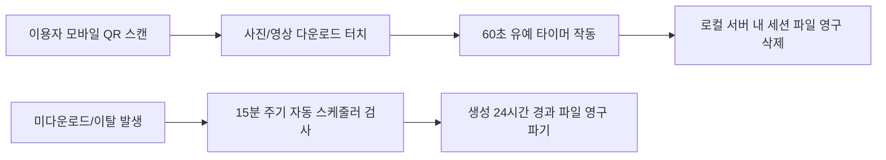

# AI 인생4컷 어플리케이션 동작 매뉴얼

이 문서는 최신 OpenAI 이미지 API(`gpt-image-1.5`, `gpt-image-2`) 기반의 **AI 연령 변환 인생4컷 (Life-Cycle 4-Cuts)** 포토부스 시스템 구동 및 이용 가이드입니다.

---

## 1. 개요 및 시스템 요구사항

본 프로젝트는 **FastAPI(Python)** 백엔드와 **HTML5 Canvas / Modern JS** 프론트엔드로 구축되어 있습니다.  
기존 로컬 GPU 기반 무거운 모델 대신 클라우드 **OpenAI 최신 이미지 모델(`gpt-image`)**을 연동하여, 고사양 외장 그래픽카드 없이도 미니 PC나 일반 노트북 환경에서 초고속으로 안정적인 서비스를 제공합니다.

* **OS**: Windows 10/11, macOS, Linux
* **Python 버전**: Python 3.9 이상
* **하드웨어 요구사항**:
  * CPU: 인텔 i5 / AMD 라이젠 5 이상 권장 (클라우드 API 처리이므로 고사양 GPU 불필요)
  * RAM: 8GB 이상
  * 웹캠/카메라: USB 웹캠 또는 내장 카메라 (1080p 이상 권장)
* **네트워크**: OpenAI API 및 클라우드 통신을 위한 인터넷 연결 필수

---

## 2. 프로젝트 디렉토리 구조

```
c:\4cuts_pjt\
├── local-server/                  # FastAPI 백엔드 및 키오스크 웹앱
│   ├── app.py                     # 메인 서버 라우터, 비동기 파이프라인 관리
│   ├── openai_transformer.py      # OpenAI gpt-image API 연동 및 투명 마스크 변환 엔진
│   ├── templates/
│   │   └── index.html             # 키오스크 촬영 메인 UI (고퀄리티 토글 포함)
│   ├── uploads/                   # 촬영 이미지 및 생성 프레임 임시 저장소
│   └── requirements.txt           # 파이썬 의존성 패키지 목록
├── 연령변환 프롬프트/              # 컷별 연령 변환 프롬프트 명세서
│   ├── 1번째 촬영 이미지 — 어린이 AI 변환 프롬프트.md
│   ├── 2번째 촬영 이미지 — 청소년·교복 AI 변환 프롬프트.md
│   ├── 3번째 촬영 이미지 — 현재 모습 원본 유지 프롬프트.md
│   └── 4번째 촬영 이미지 — 노년 AI 변환 프롬프트.md
├── vercel-frontend/               # 모바일 다운로드 뷰어 정적 웹 페이지
├── 기획.md                        # 서비스 기획 및 비동기 UX 설계서
├── {API 연동} 개발 완료 보고서.md # OpenAI API 마이그레이션 기술 보고서
└── 어플리케이션_동작_매뉴얼.md     # 본 실행 매뉴얼
```

---

## 3. 사전 환경 설정 및 서버 실행 방법

### 3.1. 필수 패키지 설치
`local-server` 디렉토리로 이동하여 필요한 파이썬 패키지를 설치합니다.

```bash
cd local-server
pip install -r requirements.txt
```

> **주요 라이브러리**: `fastapi`, `uvicorn`, `openai>=1.0.0`, `pillow`, `requests`, `apscheduler`

### 3.2. OpenAI API Key 설정 (필수)
OpenAI 계정에서 발급받은 API 키를 환경변수에 등록하거나 `.env` 파일에 작성합니다.

* **PowerShell에서 환경변수 임시 설정**:
  ```powershell
  $env:OPENAI_API_KEY="sk-proj-본인의_API_키_입력"
  ```
* **CMD에서 환경변수 임시 설정**:
  ```cmd
  set OPENAI_API_KEY=sk-proj-본인의_API_키_입력
  ```
* **영구 설정 (.env 파일 생성)**:  
  `local-server/.env` 파일을 만들고 아래 내용을 입력합니다.
  ```env
  OPENAI_API_KEY=sk-proj-본인의_API_키_입력
  ```

### 3.3. Google Drive 연동 설정 (선택 사항)
촬영 결과물을 구글 드라이브에 자동 백업하려면 Google Cloud 서비스 계정 키 파일(`google-key.json`)을 `local-server/` 디렉토리에 배치합니다.  
*(키 파일이 없어도 로컬 임시 폴더(`uploads/`)를 통해 모든 기능이 정상 동작합니다.)*

### 3.4. 백엔드 서버 구동
`local-server` 디렉토리에서 아래 명령어로 FastAPI 서버를 실행합니다.

```bash
cd local-server
python -m uvicorn app:app --host 0.0.0.0 --port 8000 --reload
```
> **💡 TIP**: `uvicorn` 단독 명령 대신 `python -m uvicorn`을 사용하면 윈도우 PATH 환경 변수 설정 여부와 관계없이 설치된 패키지를 확실하게 실행할 수 있습니다.

* 서버 시작 후 브라우저에서 `http://localhost:8000` 접속 시 키오스크 메인 화면이 실행됩니다.
* 백엔드 API 명세서(Swagger UI): `http://localhost:8000/docs`

---

## 4. 키오스크 사용 및 촬영 흐름 (User Flow)

```
[화면 1: 시작 & 옵션 선택] ──> [화면 2: 4컷 촬영 & 실시간 비동기 변환] ──> [화면 3: 결과 확인 & QR 다운로드]
```

### 4.1. [화면 1] 프레임 및 고퀄리티 옵션 선택
1. **프레임 스타일 선택**: 클래식 블랙, 파스텔 핑크, 스카이 블루 등 원하는 테두리 컬러를 선택합니다.
2. **[💎 고퀄리티 생성 (gpt-image-2)] 토글 스위치 설정**:
   * **기본값 (OFF)**: `gpt-image-1.5` 모델이 적용되어 가장 빠른 변환 속도와 안정적인 연령 변환을 제공합니다.
   * **활성화 (ON)**: 플래그십 `gpt-image-2` 모델이 적용되어 인물의 미세한 피부결, 눈가 주름, 헤어 텍스처를 극사실적으로 표현합니다.
3. **[촬영 시작하기]** 버튼을 터치하여 촬영 부스로 진입합니다.

### 4.2. [화면 2] 4컷 인터벌 촬영 & 실시간 비동기 백그라운드 변환
화면의 5초 카운트다운에 맞춰 포즈를 취하고 4번의 촬영을 진행합니다. 신규 비동기 파이프라인(Pipelining)이 적용되어 촬영 중 백그라운드에서 AI가 미리 작동합니다.

* **1컷 촬영 즉시**: **[어린이 AI 변환]** 시작 (만 5~7세 유년기 모습 변환 요청이 백그라운드로 즉시 발송됨)
* **2컷 촬영 즉시**: **[청소년·교복 AI 변환]** 시작 (만 16~18세 학창 시절 모습 변환 요청 발송)
* **3컷 촬영 즉시**: **[현재 모습 원본 유지]** (AI 변환 없이 0ms 즉시 통과, 비용과 대기시간 제로)
* **4컷 촬영 즉시**: **[노년 AI 변환]** 시작 (만 70대 온화한 황혼의 모습 변환 요청 발송)

> **💡 대기시간 제로화 효과**: 4번째 컷 촬영을 마치는 순간 이미 1, 2, 3번째 컷은 변환이 완료되어 있으므로, 이용자는 지루한 대기시간 없이 거의 즉각적으로 완성된 인생4컷을 만나볼 수 있습니다.

### 4.3. [화면 3] 최종 결과 수령 및 모바일 QR 다운로드
1. **스크롤 없는 한눈에 보기**: 완성된 4컷 사진(어린이-청소년-현재-노년)이 브라우저 창 높이에 최적화되어, 위아래 스크롤할 필요 없이 상단 1컷부터 하단 로고까지 한눈에 시원하게 표시됩니다.
2. **키오스크 화면 내 2배속 비하인드 캠 즉시 재생**:
   * [선택 완료]를 누르고 진입한 Finish 화면에서 QR 코드 상단에 **'4컷 완성본 썸네일'**과 **'⚡ 2배속 비하인드 캠 영상'** 플레이어가 함께 표시되어, 스마트폰을 꺼내기 전에도 부스 화면에서 생생하게 촬영 영상을 감상할 수 있습니다.
3. **스마트폰 QR 1초 다이렉트 저장**:
   * 화면 중앙의 **QR 코드**를 스마트폰 카메라로 스캔하면 키오스크 서버의 LAN IP(`http://<LAN_IP>:8000/download.html...`)로 직결되어, 로그인이나 복잡한 과정 없이 1초 만에 고화질 사진과 2배속 MP4 영상을 갤러리에 내려받을 수 있습니다.
4. **인화 시뮬레이션**:
   * [🖨️ 인화 출력] 버튼을 누르면 즉석 포토 프린터 인화 3단계 시뮬레이션이 진행됩니다.

---

## 5. 개인정보 보호 및 2중 자동 파기 정책

포토부스 이용자의 얼굴 사진 등 민감한 개인정보를 안전하게 보호하기 위해 2중 데이터 파기 시스템이 서버 백그라운드에서 상시 작동합니다.



1. **다운로드 즉시 파기 (60초 유예)**:
   * 이용자가 모바일 다운로드 페이지에서 사진 또는 동영상을 내려받으면 즉시 백엔드로 파기 트리거가 전달되며, 다운로드가 완료될 수 있도록 60초의 유예 시간을 부여한 뒤 해당 세션의 모든 미디어 파일(`uploads/`)을 영구 삭제합니다.
2. **24시간 정기 자동 파기 (미다운로드 대비)**:
   * 사용자가 다운로드를 받지 않고 이탈하더라도, `APScheduler`가 15분 주기로 검사하여 생성 후 24시간이 경과한 파일과 30분을 초과한 임시 파일을 100% 자동 영구 삭제합니다.

---

## 6. 문제 해결 (Troubleshooting)

### Q1. "OpenAI API Key Error" 또는 401/403 오류가 발생합니다.
* 환경변수 `OPENAI_API_KEY`가 올바르게 설정되었는지 확인하세요.
* OpenAI 플랫폼 계정에 Organization 및 Project 접근 권한이 부여되어 있는지, 사용 가능한 결제 크레딧(Credit Balance)이 남아 있는지 확인하세요.
* API 호출 실패 시 시스템은 크래시되지 않고 안전하게 원본 이미지를 폴백(Fallback) 출력하도록 설계되어 있습니다.

### Q2. 카메라 화면이 나오지 않고 검은 화면이 뜹니다.
* 브라우저 주소창 좌측의 자물쇠 아이콘을 클릭하여 **카메라 권한**이 '허용'되어 있는지 확인하세요.
* 다른 프로그램(Zoom, Teams 등)에서 웹캠을 이미 점유하고 있다면 해당 프로그램을 종료하고 페이지를 새로고침(`F5`)하세요.

### Q3. 비하인드 동영상(MP4) 생성이 되지 않습니다.
* 운영체제에 `ffmpeg`가 설치되어 있고 시스템 환경 변수(Path)에 등록되어 있는지 확인하세요.  
  *(Python 패키지 `imageio-ffmpeg`가 설치되어 있다면 대부분 자동으로 처리됩니다.)*

### Q4. 모델 속도를 더 빠르게 하려면 어떻게 하나요?
* 첫 화면(`screen-filter`)에서 **[고퀄리티 생성 (gpt-image-2)]** 토글을 끄고 기본 스탠다드 모드(`gpt-image-1.5`)를 이용하시면 가장 빠른 반응 속도로 부스를 운영하실 수 있습니다.

### Q5. pip 설치 시 'The script uvicorn.exe is installed in ... which is not on PATH' 경고가 뜹니다.
* 이는 패키지는 정상 설치되었으나 실행 파일 디렉토리가 윈도우 PATH에 등록되지 않아 발생하는 경고입니다.
* 서버 실행 시 `uvicorn` 대신 `python -m uvicorn app:app --host 0.0.0.0 --port 8000 --reload` 명령어를 사용하시면 PATH 등록 없이도 바로 정상 구동됩니다.

