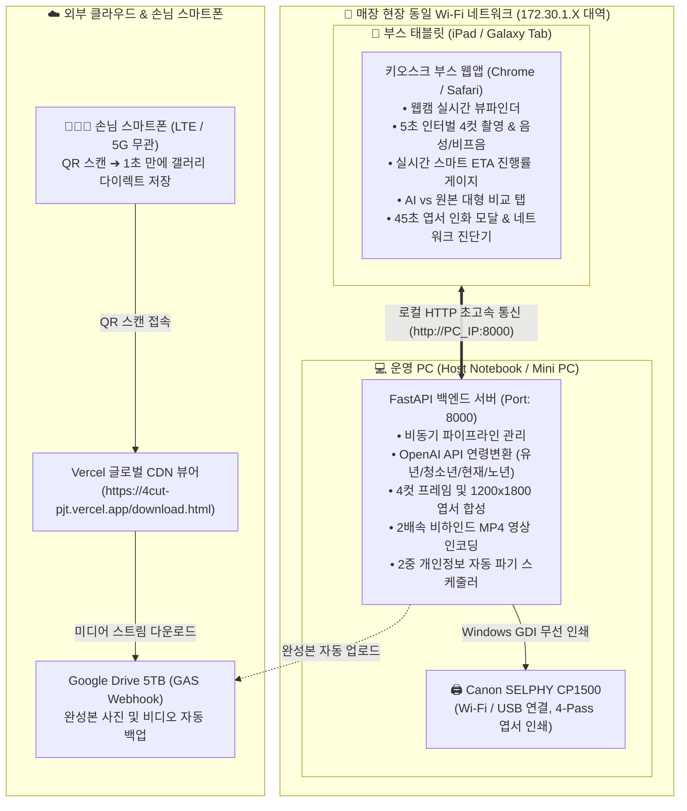

# AI 인생4컷 포토부스 현장 운영 및 인수인계 매뉴얼

본 문서는 최신 OpenAI 이미지 모델(`gpt-image-1.5`, `gpt-image-2`) 기반의 **AI 인생 사계절(연령 변환) 4컷 포토부스 시스템**을 매장/행사 현장에서 **운영 PC(Host PC)**와 **태블릿(키오스크 부스)**으로 구성하여 안정적으로 설치, 구동, 운영 및 인수인계할 수 있도록 작성된 종합 실무 매뉴얼입니다.

---

## 1. 시스템 전체 구성도 및 동작 아키텍처

본 시스템은 **동일한 Wi-Fi 공유기 환경**에서 운영 PC와 태블릿이 0ms 지연 없이 통신하고, 손님의 스마트폰은 **LTE/5G/외부망 상관없이 Vercel 클라우드를 통해 1초 만에 사진과 영상을 수령**할 수 있도록 설계된 **하이브리드 No-DB 아키텍처**입니다.



---

## 2. 장비 및 사전 환경 준비 (준비물 체크리스트)

| 구분 | 준비 장비 및 권장 사양 | 비고 |
| :--- | :--- | :--- |
| **운영 PC (Host)** | Windows 10/11 노트북 또는 미니 PC<br>• CPU: Intel i5 / AMD Ryzen 5 이상<br>• RAM: 8GB 이상<br>• Python 3.9 ~ 3.12 설치 환경 | OpenAI 클라우드 API를 사용하므로 고가의 외장 GPU 불필요 |
| **부스 태블릿** | Android 태블릿(Galaxy Tab 등) 또는 iPad<br>• 권장 브라우저: **Chrome(크롬)**<br>• 전면 카메라 해상도 1080p 이상 권장 | 터치 조작 및 세로 거치대 구비 |
| **무선 인화기** | **Canon SELPHY CP1500**<br>• 전용 용지 및 잉크 카세트 (KP-108IN, RP-108 등)<br>• 4x6 엽서 (Postcard Size) 규격 | PC에 공식 프린터 드라이버 사전 설치 필수 |
| **네트워크** | 매장 내 유무선 공유기 (Wi-Fi)<br>• 2.4GHz 또는 5GHz Wi-Fi | **운영 PC와 태블릿이 반드시 '같은 공유기 Wi-Fi'에 접속**해야 함 |

---

## 3. [1단계] 운영 PC (Host) 설정 및 백엔드 실행

### 3.1. Windows 방화벽 포트(8000번) 1회 허용 (최초 1회만 실행)
태블릿이 PC의 8000번 포트로 원활히 접근할 수 있도록 윈도우 방화벽 인바운드 규칙을 추가합니다.

1. PC에서 **Windows 시작 버튼 우클릭 ➔ '터미널(관리자)' 또는 'PowerShell(관리자)'**을 실행합니다.
2. 아래 명령어를 복사하여 붙여넣고 엔터를 누릅니다:
   ```powershell
   New-NetFirewallRule -DisplayName "FastAPI 8000" -Direction Inbound -LocalPort 8000 -Protocol TCP -Action Allow
   ```
   *(이미 규칙이 등록되어 있다면 통과됩니다.)*

### 3.2. 운영 PC의 현재 Wi-Fi IP 확인하기
PC가 공유기로부터 할당받은 무선 LAN IP를 확인합니다.

1. PowerShell 또는 명령 프롬프트(CMD)에서 실행:
   ```cmd
   ipconfig
   ```
2. 출력 결과 중 **`무선 LAN 어댑터 Wi-Fi:`** 항목의 **`IPv4 주소`**를 확인합니다.
   * **예시:** `172.30.1.65` (또는 `192.168.0.X`)
   > [!CAUTION]
   > `이더넷 어댑터 vEthernet`이나 `192.168.56.1` 같은 가상머신(VirtualBox) IP는 태블릿이 접속할 수 없습니다. 반드시 **공유기와 연결된 무선 LAN 어댑터의 IPv4 주소**를 확인하세요.

### 3.3. OpenAI API 키 확인
`c:\4cuts_pjt\local-server\.env` 파일에 유효한 OpenAI API 키가 등록되어 있는지 확인합니다:
```env
OPENAI_API_KEY=sk-proj-xxxxxxxxxxxxxxxxxxxxxxxxxxxxxxxx
```

### 3.4. Canon SELPHY CP1500 인화기 준비
1. CP1500 전원을 켜고, 엽서(Postcard) 크기 18매 카세트와 잉크를 장착합니다.
2. PC와 CP1500을 **USB 케이블로 직결**하거나, **매장 동일 Wi-Fi**에 연결합니다.
3. Windows [설정] ➔ [Bluetooth 및 장치] ➔ [프린터 및 스캐너]에 `Canon SELPHY CP1500`이 '기본 프린터' 또는 정상 등록되어 있는지 확인합니다.

### 3.5. 백엔드 서버 구동
1. 터미널(PowerShell)을 열고 `local-server` 폴더로 이동합니다.
2. 백엔드 서버를 가동합니다:
   ```powershell
   cd c:\4cuts_pjt\local-server
   python -m uvicorn app:app --host 0.0.0.0 --port 8000
   ```
3. 터미널에 `Application startup complete.` 문구가 표시되면 운영 PC 준비가 완료된 것입니다.

---

## 4. [2단계] 태블릿 (부스 키오스크) 설정 및 실행

### 4.1. 태블릿 Wi-Fi 확인
* 태블릿의 Wi-Fi 설정에 들어가서 **운영 PC와 완전히 동일한 Wi-Fi 공유기 이름(SSID)**에 연결되어 있는지 확인합니다.

### 4.2. 태블릿 크롬(Chrome) 웹캠 보안 1회 허용 (핵심 필수 작업!)
모던 모바일 브라우저는 IP 주소(`http://`) 접속 시 보안상 카메라를 기본 차단합니다. 이를 **안전한 주소로 1회 예외 승인**해 주어야 웹캠이 정상 작동합니다.

1. 태블릿에서 **Chrome(크롬) 앱**을 실행합니다.
2. 상단 주소창에 아래 주소를 입력하고 이동합니다:
   ```text
   chrome://flags/#unsafely-treat-insecure-origin-as-secure
   ```
3. 화면 맨 위에 노란색으로 하이라이트된 **`Insecure origins treated as secure`** 설정이 나타납니다:
   * 제목 바로 밑의 **네모난 빈 입력 박스**에 운영 PC의 주소를 입력합니다:
     👉 **`http://172.30.1.65:8000`** *(3.2단계에서 확인한 본인 PC IP와 :8000 포트)*
   * 그 아래 드롭다운 메뉴를 `사용 중지됨 (Disabled)` ➔ **`사용 (Enabled)`**으로 변경합니다.
4. 화면 우측 하단에 나타나는 파란색 **`Relaunch (다시 시작)`** 버튼을 누릅니다. 크롬이 자동으로 재시작됩니다.

### 4.3. 포토부스 키오스크 실행
1. 재실행된 크롬 주소창에 백엔드 주소를 입력하고 접속합니다:
   👉 **`http://172.30.1.65:8000`**
2. 브라우저에서 **"카메라 권한을 허용하시겠습니까?"** 팝업이 뜨면 **[허용]**을 누릅니다.
3. 시원하고 깔끔한 AI 인생4컷 키오스크 메인 홈 화면(`AI 4-CUT STUDIO`)이 나타납니다!

### 4.4. 전체화면 전용 앱 모드 설정 (선택 권장)
* 브라우저 상단 주소창 및 탭 바를 숨겨 손님이 다른 창으로 이탈하지 못하도록 설정합니다:
  * **Android 태블릿**: 크롬 우측 상단 메뉴(점 3개) ➔ **[홈 화면에 추가]** 또는 **[앱 설치]** 터치 후 홈 화면 아이콘으로 실행.
  * **iPad**: Safari 하단 공유 버튼 ➔ **[홈 화면에 추가]** 터치 후 실행.

---

## 5. [3단계] 현장 테스트 및 포토부스 손님 이용 플로우

부스를 오픈하기 전, 운영자가 1회 전체 플로우를 직접 테스트합니다.

```
[화면 1: 메인 홈] ➔ [화면 2: 테마 선택] ➔ [화면 3: 4컷 촬영] ➔ [화면 4: 캡처본 확인] ➔ [화면 5: 탭 비교] ➔ [화면 6: 스마트폰 QR & 인화]
```

### 5.1. [화면 1] 메인 홈 화면
* 상단 네트워크 상태 뱃지가 **`🟢 네트워크 정상 (0ms)`**으로 떠 있는지 확인합니다.
* 뱃지 우측의 **`⚙️` 아이콘**을 누르면 [현장 네트워크 & IoT 연동 진단기]가 열리며, CP1500 인화기 감지 상태(`🟢 온라인`)와 용지 잔여량(`잔여 18 / 18매`)을 실시간 점검할 수 있습니다.
* **`📸 촬영 시작하기`** 버튼을 터치합니다.

### 5.2. [화면 2] AI 스타일 선택
* 맨 첫 번째에 위치한 **`👑 BEST 인기 ⏳ 인생 사계절 (연령 변환)`** 테마가 기본 선택되어 있습니다.
* 상단 **`💎 고퀄리티 AI 생성 모드`** 토글 스위치:
  * **OFF (기본)**: `gpt-image-1.5` 모델 가동 (변환 시간 50~60초, 초고속)
  * **ON**: `gpt-image-2` 플래그십 모델 가동 (변환 시간 70~85초, 극사실적 피부/주름 텍스처)
* 하단 **`다음 (촬영 준비) ➔`**를 터치합니다.

### 5.3. [화면 3] 사진 4컷 연속 촬영
* 태블릿 전면 카메라 화면이 부드럽게 표시됩니다.
* 하단의 **`🚀 4컷 연사 시작`** 버튼을 터치하면 5초 카운트다운과 함께 촬영이 시작됩니다:
  * **1컷 촬영 즉시**: 👶 어린이(유년기) AI 변환 백그라운드 발송
  * **2컷 촬영 즉시**: 🧑‍🎓 청소년(교복) AI 변환 백그라운드 발송
  * **3컷 촬영 즉시**: ✨ 현재 모습 100% 원본 보존
  * **4컷 촬영 즉시**: 👵 노년(황혼) AI 변환 백그라운드 발송
  * *(촬영하는 전 과정이 2배속 비하인드 동영상으로 백그라운드 동시 녹화됩니다.)*

### 5.4. [화면 4] 촬영본 확인 & AI 변환 생성
* 캡처된 4장의 원본 사진 썸네일을 확인하고, 마음에 들지 않으면 **`🔄 재촬영`**, 만족스러우면 **`✨ AI 변환 생성`**을 누릅니다.
* 미니멀 프리미엄 로딩 오버레이가 나타나며, 지능형 적응형 프로그레스 바(Smart ETA)가 진행률을 95% ➔ 96% ➔ 97%로 부드럽게 안내합니다.

### 5.5. [화면 5] 변환 완료 상세 뷰어 (AI vs 원본 탭 뷰)
* 상단 탭을 터치하여 **`✨ AI 스타일 4컷 (생애 주기 사계절)`**과 **`📷 원본 촬영 4컷`**을 대형 고화질 화면으로 번갈아 비교 감상합니다.
* 원하는 프레임을 선택한 후 **`선택 완료 (QR & 인화) ➔`**를 터치합니다.

### 5.6. [화면 6] 스마트폰 QR 수령 & 엽서 인화 출력
1. **스마트폰 QR 다이렉트 다운로드**:
   * 손님이 본인 스마트폰(아이폰/갤럭시) 카메라로 화면의 **QR 코드**를 스캔합니다.
   * 스마트폰이 LTE/5G 환경이더라도 클라우드 **Vercel 다운로드 페이지(`https://4cut-pjt.vercel.app/download.html`)**가 1초 만에 열립니다.
   * **[⬇️ 4컷 사진 즉시 저장]** 및 **[⬇️ 2배속 비하인드 영상 즉시 저장]** 버튼을 터치하여 갤러리에 저장합니다.
2. **Canon CP1500 엽서 무선 인화**:
   * **`🖨️ 엽서 인화 출력`** 버튼을 터치하면 인화 모달이 실행됩니다.
   * 45초 카운트다운과 함께 인화기가 가동되며, **사진이 앞뒤로 4번 왕복(노랑 ➔ 빨강 ➔ 파랑 ➔ 코팅)**하며 최고급 300 DPI 4x6 엽서가 출력 배출됩니다.
   > [!WARNING]
   > 인화 중 사진이 앞뒤로 4번 왕복할 때 기어 파손 방지를 위해 완전히 트레이에 멈출 때까지 절대 손으로 잡아당기지 마십시오.
3. 인화 완료 후 **`🏠 처음으로 (새로운 촬영)`** 버튼을 누르면 다음 손님을 위한 초기 상태로 자동 리셋됩니다.

---

## 6. 개인정보 보호 및 2중 자동 파기 체계

손님의 얼굴 사진 및 비하인드 영상은 개인정보보호법을 준수하여 **2중 자동 파기 엔진**에 의해 흔적 없이 영구 소멸됩니다.

1. **다운로드 즉시 60초 유예 파기**:
   * 손님이 스마트폰에서 다운로드 버튼을 누르면 서버로 파기 트리거가 전송되며, 사진과 영상을 모두 안전하게 받을 수 있도록 **60초 카운트다운 후 로컬 파일(`uploads/`)을 영구 삭제**합니다.
2. **24시간 정기 자동 파기**:
   * 손님이 다운로드를 받지 않고 이탈하더라도, 백엔드 내장 `APScheduler`가 15분 주기로 검사하여 생성 후 24시간이 경과한 모든 파일과 30분을 초과한 임시 파일을 100% 자동 영구 삭제합니다.

---

## 7. 운영 트러블슈팅 가이드 (FAQ)

### Q1. 태블릿에서 "웹캠을 연결할 수 없습니다" 오류가 발생합니다.
* **원인**: 태블릿 크롬의 비보안 IP 보안 예외(Secure Context) 설정이 누락되었거나 IP 주소가 변경된 경우입니다.
* **해결**: [4.2단계]로 돌아가서 태블릿 크롬의 `chrome://flags/#unsafely-treat-insecure-origin-as-secure` 설정에 현재 PC의 주소(`http://172.30.1.X:8000`)가 올바르게 입력되어 `Enabled` 상태인지 확인하고 `Relaunch`를 누르세요.

### Q2. 태블릿에서 "사이트에 연결할 수 없음" (ERR_CONNECTION_REFUSED / TIMED_OUT)이 뜹니다.
* **원인 1**: PC에서 백엔드 서버(`uvicorn`)가 꺼져 있는 경우입니다. ➔ PC 터미널에서 `python -m uvicorn app:app --host 0.0.0.0 --port 8000`을 실행하세요.
* **원인 2**: 태블릿과 PC가 서로 다른 Wi-Fi에 연결되어 있는 경우입니다. ➔ 두 기기가 완전히 동일한 공유기 Wi-Fi에 접속되어 있는지 확인하세요.
* **원인 3**: 공유기가 재부팅되어 PC의 IP 주소가 바뀌었을 수 있습니다. ➔ PC에서 `ipconfig`를 다시 쳐서 바뀐 IP를 확인하세요.
* **원인 4**: 윈도우 방화벽에 막힌 경우입니다. ➔ [3.1단계]의 방화벽 8000번 포트 허용 명령어를 관리자 권한으로 실행하세요.

### Q3. Canon SELPHY CP1500 인화기가 반응하지 않거나 인쇄가 멈춥니다.
* **원인 1**: 용지 카세트 18매가 소진된 경우입니다. ➔ 전원을 끄지 말고 카세트에 새 용지(광택면이 위를 향하도록)를 보충하면 자동으로 재개됩니다.
* **원인 2**: 잉크 카트리지 리본이 소진된 경우입니다. ➔ 기기 우측 레버를 열어 새 잉크 카트리지로 교체하세요.
* **원인 3**: USB 케이블이나 Wi-Fi 연결이 끊긴 경우입니다. ➔ 메인 홈 화면 상단의 `⚙️` 아이콘을 눌러 [진단기]에서 `🧪 테스트 엽서 1장 출력`을 눌러 정상 스풀링 여부를 테스트하세요.

### Q4. "OpenAI API Key Error" 또는 401 오류가 발생합니다.
* **해결**: `local-server/.env` 파일의 `OPENAI_API_KEY` 값에 오타가 없거나, OpenAI 계정 크레딧 잔액이 남아있는지 확인하세요.

---

## 8. 인수인계 체크리스트 (일일 오픈 & 마감 루틴)

### [오픈 루틴 (5분 소요)]
- [ ] 공유기 전원 ON ➔ 운영 PC 및 태블릿을 동일 Wi-Fi에 연결
- [ ] CP1500 인화기 전원 ON ➔ 용지 18매 및 잉크 카트리지 확인
- [ ] 운영 PC: 터미널 열고 `python -m uvicorn app:app --host 0.0.0.0 --port 8000` 실행
- [ ] 태블릿: 크롬 열고 `http://<PC_IP>:8000` 접속 ➔ 웹캠 작동 확인
- [ ] 테스트 1회 진행: 4컷 촬영 ➔ 연령 변환 ➔ 스마트폰 QR 스캔 ➔ 엽서 1장 시험 출력 완료 확인

### [마감 루틴 (2분 소요)]
- [ ] 운영 PC: 터미널에서 `Ctrl + C`를 눌러 백엔드 서버 종료
- [ ] 태블릿: 크롬 앱 닫기 및 전원 OFF
- [ ] CP1500 인화기: 전원 버튼을 길게 눌러 정상 종료 (인화 도중 강제 전원 분리 금지)
- [ ] 잔여 인화지 및 잉크 카세트 안전 보관
